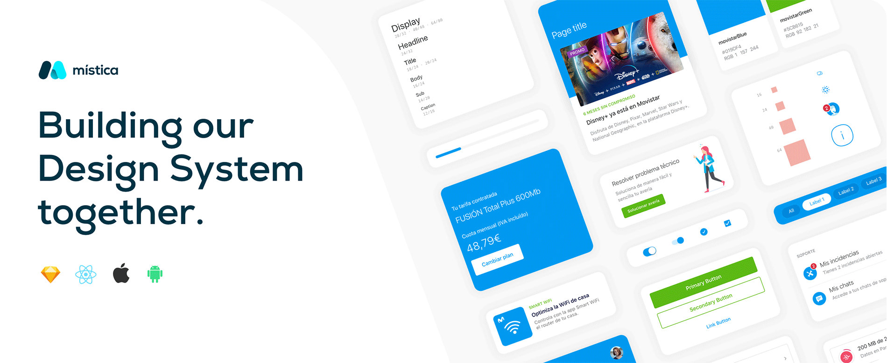

### What is Mística?

 

Mística is Telefónica´s Digital Design System. An open and collaborative system for the whole ecosystem of digital products and services in Telefónica.

It is a common design language that provides tools and guidelines with compliant components to deliver your next Telefónica’s digital experience.

The aim of Mistica is to help Telefonica designers and developers deliver work faster and better. It provides teams with a common language and encourages adherence to design guidelines with compliant components right out of the box.
 

- <b>It is the language of the entire Telefónica CX universe</b> 
Mística enables us to have a universal language with which to develop our products.

- <b>Consistency in all our products</b> 
This consistency will be reflected in a better, unique and consistent user experience.

- <b>Optimizing the design process</b> 
Mística reduces design and development time in order to be able to put more effort into improving and evolving our product.

- <b>Flexibility and optimization</b> 
Iterations and improvements will be carried out at all times based on the needs and points of improvement that we identify among ourselves.

 

| Mística Development Repos | Description                                               |
| :------------------ | :-------------------------------------------------------- |
| [mistica-web](https://github.com/Telefonica/mistica-web)      | React components library for Telefonica Design System (Mistica)  |
| [mistica-android](https://github.com/Telefonica/mistica-android)      | Native Android components library for Telefonica Design System (Mistica)
| [mistica-ios](https://github.com/Telefonica/mistica-ios)     | Native iOS components library for Telefonica Design System (Mistica)  |
 

| Mística Design Repos | Description                                               |
| :------------------ | :-------------------------------------------------------- |
| [mistica-design](https://github.com/Telefonica/mistica-design) | Libraries with components, colors & typographies needed to design our digital products  |
| [mistica-icons](https://github.com/Telefonica/mistica-icons)      | The source of truth for icons in our digital products |

[Visit Design documentation](https://brandfactory.telefonica.com/mistica)

## Contributing

See [CONTRIBUTING.md](./CONTRIBUTING.md)
