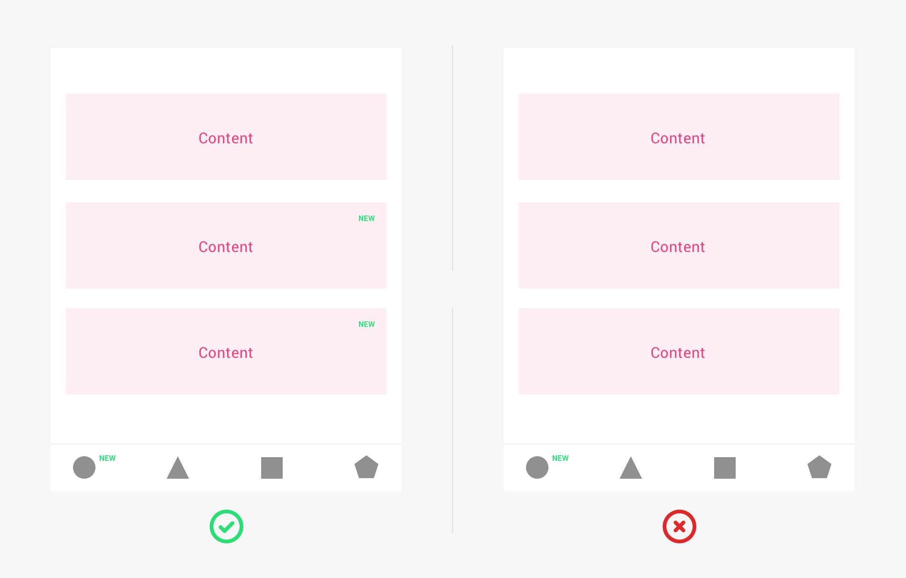
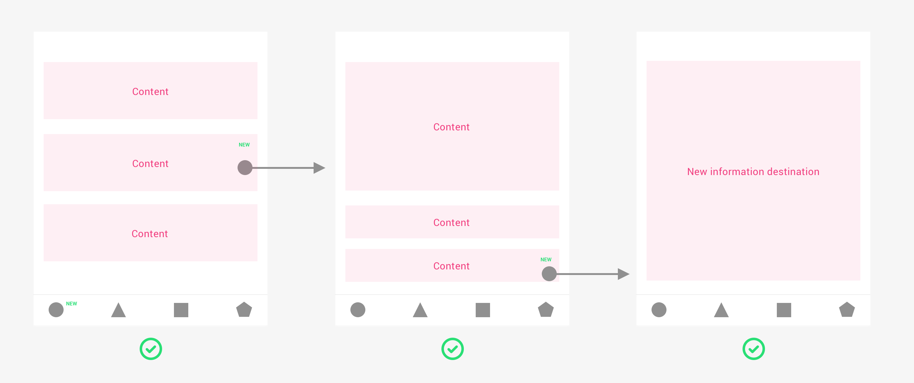
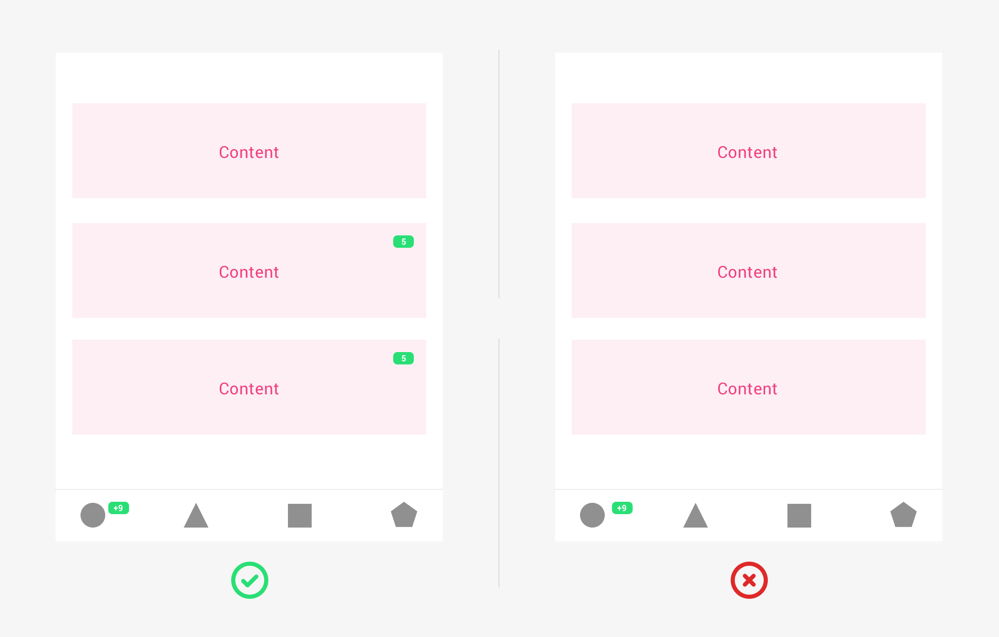
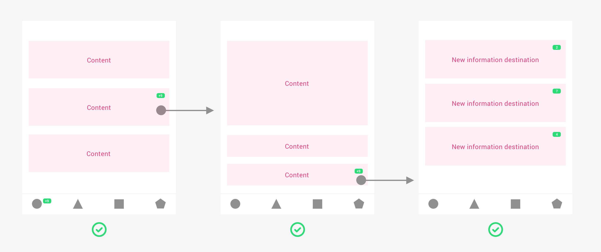
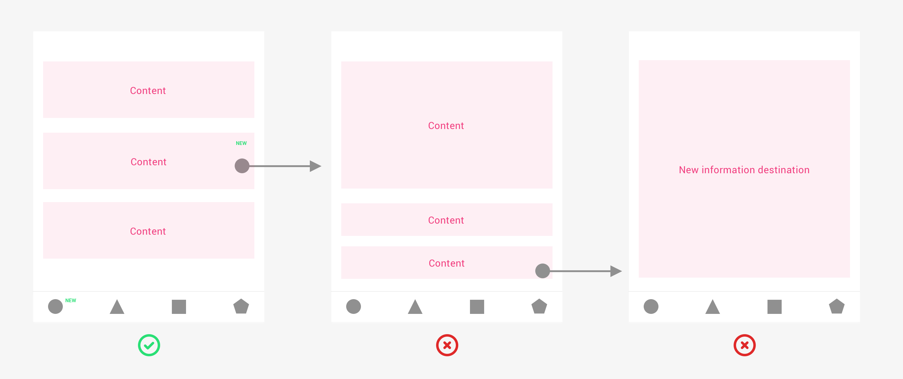
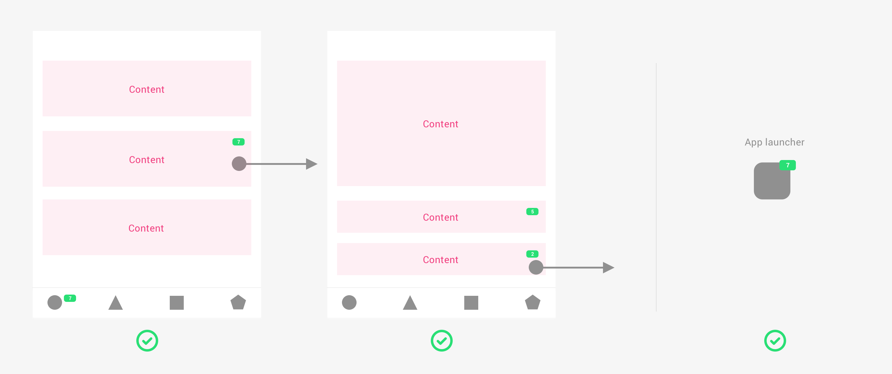

### Component Preview
<MultiBrandExample>
    <Stack space={16}>
        
    </Stack>
</MultiBrandExample>

 
    
 

### What is a badge?

A badge is an element used to indicate the user that there is new information associated with any component in the app.

For example, new information could be:

* A new offer in an existing carrousel
* A new message in an existing support chat

### What is not a badge?

A badge is not an element used to indicate the user the existence of new features in the app. Another element should be used for that objective.  

#### What is a new feature and new information in the app?

Let’s explain it with examples:

* New feature: a new area in the app that displays new available plans. 
  * New information: a new plan is included in that area.
* New feature: a new area in the app that shows the latest mobile phone launches. 
  * New information: a new mobile launch is included in that area.

The badge definition is split into 2 types of badge: 

* Non-numeric badge
* Numeric badge. 

## Non-numeric badge

### Definition

The non-numeric badge is an element displayed on any component of the app to indicate the user that there is **new non-urgent and impersonal information** associated with it.

The non-numeric badge is used for:

* Non-urgent and impersonal use cases
  * To indicate the user that is new information available. The new available information is not personal. It is available for a group of users, not for each single user.

The non-numeric badge:

* Should **not send push notifications** or other communications to the users
* Should **not count in the app launcher badge**

### Behavior

#### **New information is available**

* The non-numeric badge is **displayed on the element that contains new information.**
  * If an element of the screen contains new information, **the tab bar should also indicate** the new information existence. 

#### Connection between the badge and the new information

* The non-numeric badge should **guide the user** to the new information.
  * If the new information is placed at inner navigation levels, the badge should guide the user until the final new information destination \(like a breadcrumb\).

#### Easy to clear

* The non-numeric badge totally disappears when the new information is displayed on the screen or viewed by the user.

#### Anatomy

* The non-numeric badge has **no numbers.**
* It is recommended to place the non-numeric badge on the **right or upper right side** of the element that is indicating the existence of new information.

## Numeric badge

### Definition

The numeric badge is an element displayed on any component to indicate the user that there is **new personal and urgent information -- only conversations and personal communications** associated with it.

The numeric badge is used for:

* More urgent and personal use cases
  * To indicate the user that is new information available. It is **only available for each single user:**
    * For example, new personal communication or conversation 

The numeric badge:

* Should **send push notifications** or other communications to the users
* Should **count in the app launcher badge**

### Behavior

#### New information is available

* The numeric badge is displayed on the element that contains **new information -- conversations and communications**
  * If an element of the screen contains new information -- conversations and communications, the **tab bar should also indicate** the new information existence. 
    * The number displayed on each tab should indicate the sum of the total number of new information -- conversations and communications distributed on that screen.

#### Connection between the badge and the new information

* The numeric badge should guide the user to the new information.
  * If the new information is placed at inner navigation levels, the badge should guide the user until the final new information destination \(like a breadcrumb\).

#### Easy to clear

* The numeric badge totally disappears when the new information is displayed on the screen or viewed by the user.
  * If the user has a numeric badge with number 9 and displays 5 new pieces of information, the badge should be discounted by 5 showing number 4.
    * The same logic is replied in the app launcher

#### Anatomy

* The numeric badge has a maximum of 2 digits. from 1 to 9. If the number of new information is more than 9, the numeric number should display a +9.
* It is recommended to place the numeric badge on the right or upper right side of the element that is indicating the existence of new information.

