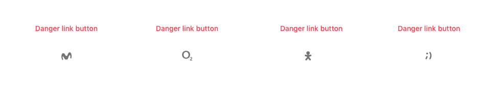
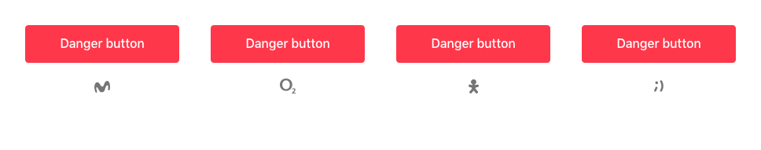
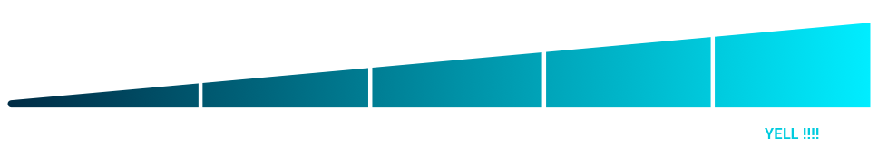
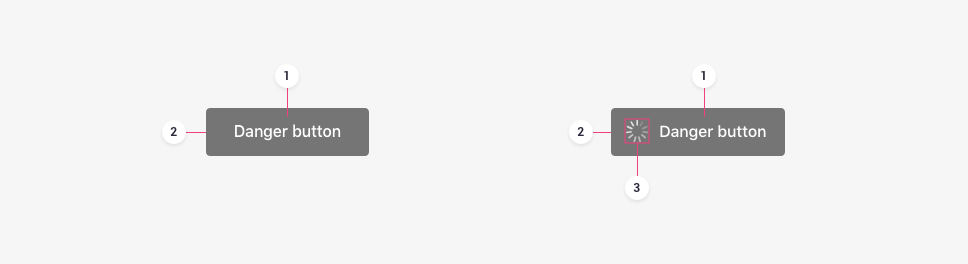
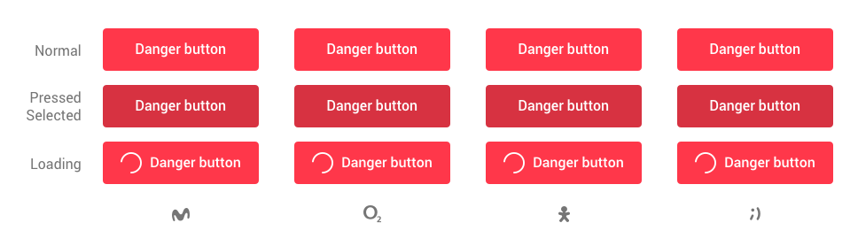

It identifies destructive actions and always raises a confirmation for doing the action.

# Danger button

## Typology

There are two kinds of danger buttons:

#### Link style

Used on **mobile** and **desktop** to open the **confirmation page** for the action.

#### Button style

Used on **desktop** as a **confirmation action** for doing a destructive action.

## Usage

They can only be used exclusively for what are called **destructive actions**, like deleting. There should be very few cases where this kind of button is needed throughout the app. ‌

Its usage should be different depending on whether the user is on mobile or desktop:

#### Mobile

Danger buttons open the platform's **native dialogue** to confirm the action.

#### Desktop

Danger buttons lead to a **confirmation interface** where there is another danger button with greater visual force for **executing the action**.

## Hierarchy

They should not be accompanied by other actions on mobile. They can be accompanied by another action on the confirmation interface on desktop. When it's accompanied by other actions, it will be the **element at the top of the hierarchy**, and consequently, it should be positioned in the first place.

## Emphasis

Danger buttons give a **very strong emphasis** to what they communicate. It would be like yelling at the user about “dangerous” actions. This helps users pause and read the information shown on the screen carefully.

## Anatomy

### Link style

The link style consists of:

#### Text label

It should describe the action that is going to happen when the user interacts with the button as concisely as possible.

### Button style

The button style consists of:

#### Text label

It should describe the action that is going to happen when the user interacts with the button as concisely as possible.

#### Container

The background visually identifies the relevance of the button in relation to other buttons on the interface.

#### Icon \(optional\)

This element can accompany a text label to communicate a message more clearly.

## States

A danger button can have the following states:

* Normal
* Pressed \(Android\) or Selected \(iOS\)
* Clicked \(Desktop\)
* Loading
* Focus \(this accessibility state is determined by the system\)


Buttons must never have a disabled state. Helping users by showing an error message is significantly more effective than using a disabled button and having the user try to figure out the reasons why the button is disabled. That situation frequently makes users decide to give up on a process or even stop using the application.


