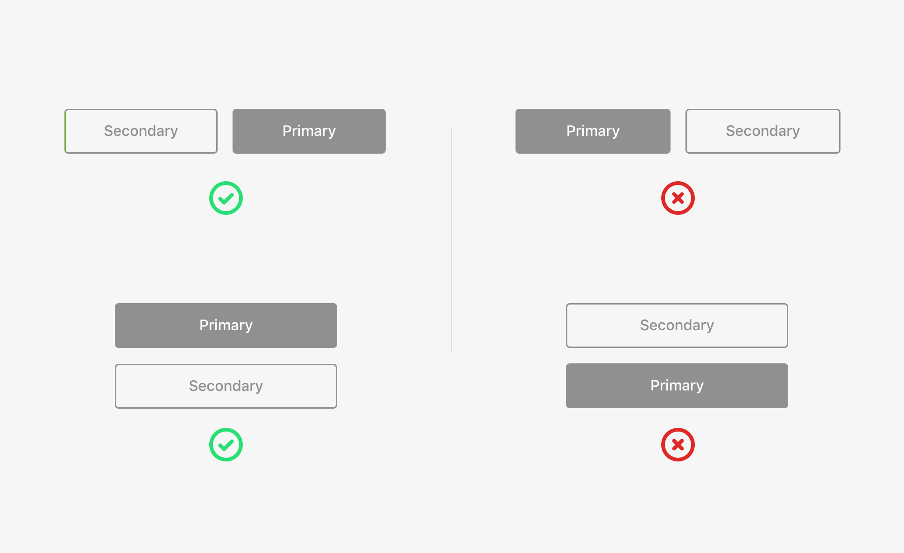
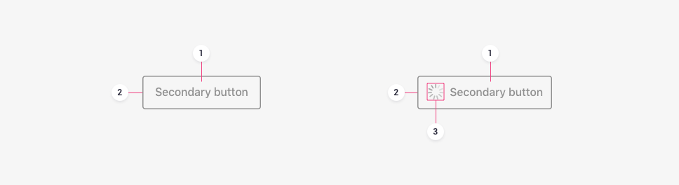
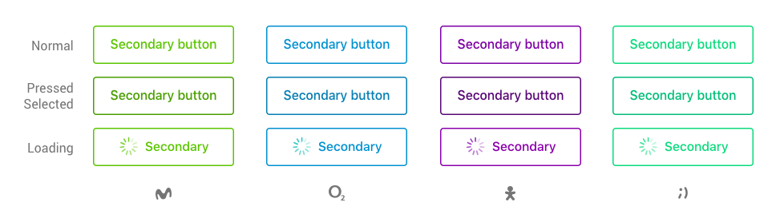

 
<MultiBrandExample>
    <Inline space={16}>
        <ButtonSecondary submit>Button action</ButtonSecondary>
    </Inline>
</MultiBrandExample>
 

---

It responds to an action that is complementary to the primary button with a lower hierarchy and visual weight.

## Usage

A secondary button has three possible uses:

* It accompanies a primary button and provides a **complementary** or **alternative action**. 
* It represents an action with **less visual weight** than a primary button has. 
* They are also used to represent **non-continuing actions** that cause a return to a “0 state” of the process.

## Hierarchy

They are below primary buttons in the hierarchy. Because of that, when they accompany a primary button, they go **after it**.

## Emphasis

Secondary buttons give a **medium emphasis** to what they communicate. It's as if they encouraged users to do a certain action.

## Anatomy

### Text label

It should describe the action that is going to happen when the user interacts with the button as concisely as possible.

### Container

Their background should have an outline with a ghost style. This way, they will be less important visually than the primary button.

### Icon \(optional\)

Their background should have an outline with a ghost style. This way, they will be less important visually than the primary button.

## States

A secondary button can have the following states:

* Normal
* Pressed \(Android\) or Selected \(iOS\)
* Clicked \(Desktop\)
* Loading
* Focus \(this accessibility state is determined by the system\)

:::note
Buttons must never have a disabled state. Helping users by showing an error message is significantly more effective than using a disabled button and having the user try to figure out the reasons why the button is disabled. That situation frequently makes users decide to give up on a process or even stop using the application.
:::

