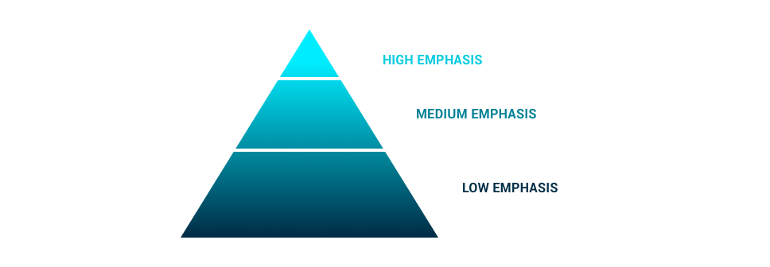

The buttons **communicate actions** that users can do. In the interface, buttons can be found in:

* Flows
* Modals
* Cards
* Forms
* Feedback messages
* Accompanying interface elements
* ...

In order for the actions to be immediately visible and easy for users to do, every button must be **identifiable**, **easy to find** in the interface and it must be **specific**.

**Identifiable**

The visual appearance of a button must show that it is an interactive component that initiates an action.

**Prominent**

A button must be easy to scan on a screen shared with other elements, including other buttons.

**Specific**

The action started by a button must be clear and direct.

## Typology

The usage of every button will depend on its context and the functionality we want to provide.

| Button | Description | Emphasis |
| :--- | :--- | :--- |
| **Primary button** | Main interface action. | High |
| **Secondary button** | Action complementary to the primary button. They are also used to represent non-continuing actions that cause a return to a “0 state” of the process. | Medium |
| **Icon button** | Focus delimits interactive areas that act as distribution elements. | Medium |
| **Link button** | Link to contextual interface information. | Low |
| **Contextual button** | Accompanies a specific element of the interface and causes an instantaneous action on that component. | Low |
| **Danger button** | Causes a destructive and irreversible action. | High |

### Variations

| Button | Description | Emphasis |
| :--- | :--- | :--- |
| **Small button** | These are very small buttons used inside certain components where, because of space and design needs, a smaller size is more appropriate. | High, medium, low |
| **Inverse button** | Inverts the primary, secondary and link button style using a coloured background. | High, medium, low |

