<MultiBrandExample>
    
</MultiBrandExample>

 
    
 

This documentation establishes which components should designers in Novum incorporate when giving feedback to our users. For instance, providing the result of an action or process, requesting actions or giving important information beforehand.

In the first section [Feedback scenarios](feedback-scenarios/) we define the different possible scenarios we may find depending on the type of information we want to provide our users. Please read the definition of each scenario carefully in order to find out which component to use for every platform \(iOS, Android and web\).

In the second section [Components](components/) we list and give specific recommendations around the use of each component for every platform.

## Success messages

### Definition

We define success scenarios as those where we need to communicate users that an action or process has been completed without any errors.

### Component use

**By default, try to communicate the success of an action or process implicitly** in the user interface without using a specific component. Ideally the result of that action or flow should be clearly visible in the very own interface:

1. Example: creating a support query through a multi-step process results in the redirection to the detail screen of that query just created. 
2. Example two: completing a “send balance” process from a conversation results in a message being inserted into it.

For long multi-steps processes or those where any kind of purchase is involved \(plan upgrades, top up’s, etc.\) a success screen should be used. This is a specific screen that explicitly states the success of the process and is able to provide extra information or multiple actions to do next.

Please check out:

* for iOS the [iOS success screen](../components/ios/success-screen.md)
* for Android the [Android success screen](../components/android/success-screen.md)
* for web the [web success screen](../components/web/success-screen.md)

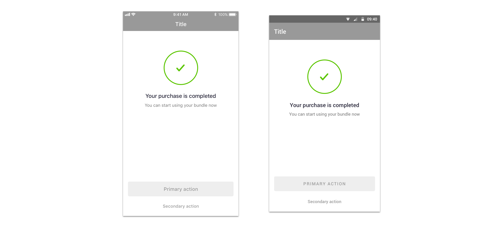

For **small and very specific actions** where it’s not possible to communicate success implicitly and where a success screen may be unnecessary \(for short processes or those not related with purchases, balance, upgrades, etc.\) consider using:

* in iOS a [crouton](../components/ios/crouton.md)
* In Android a [snackbar](../components/android/snackbar.md)
* in web a [snackbar](../components/web/snackbar.md)

Please use this components **sparingly**, as we should communicate implicitly the success of any action or process whenever possible.

## Error messages

### Definition

We define error scenarios as those where we need to communicate users that an action or process hasn’t been completed successfully.

### Component use

For loading errors specifically, where the content of a screen or even a specific module couldn’t be loaded properly, please use:

* for iOS a [load error](../components/ios/load-error.md)
* for Android a [load error](../components/android/load-error.md)
* for web a [load error](../components/web/load-error.md)

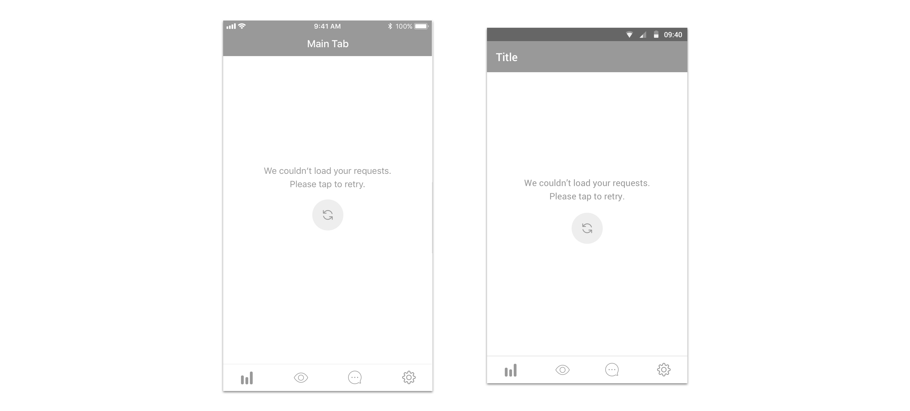

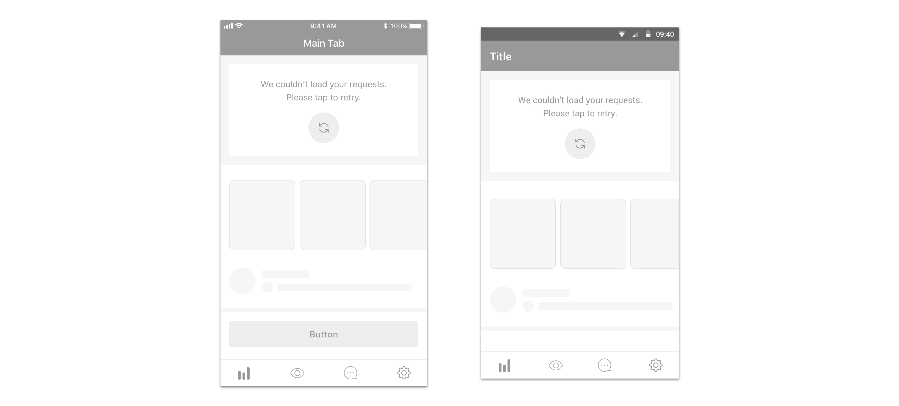

By default, and for any error of high importance consider communicating errors in the same screen of the triggering action using:

* for iOS an [alert](../components/ios/alert.md)
* for Android a [dialog](../components/android/dialog.md)
* for web a [dialog](../components/web/dialog.md)

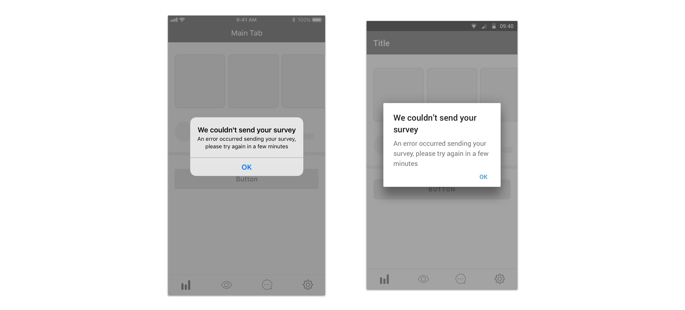

Showing the error in the same page, so users can easily retry the action or edit something if they have to should always be preferred. In these cases, if the action to submit provokes a loading time it should be indicated in the submit button with a spinner.

However, even though showing the error in the same screen should be preferred, technically it may not always be possible. In these cases consider using an error screen. This may also be useful in cases where we want to provide users extensive information and/or multiple actions, which may be difficult to accommodate in an alert or dialog. Please check out:

* for iOS an [error screen](../components/ios/error-screen.md)
* for Android an [error screen](../components/android/error-screen.md)
* for web an [error screen](../components/web/error-screen.md)

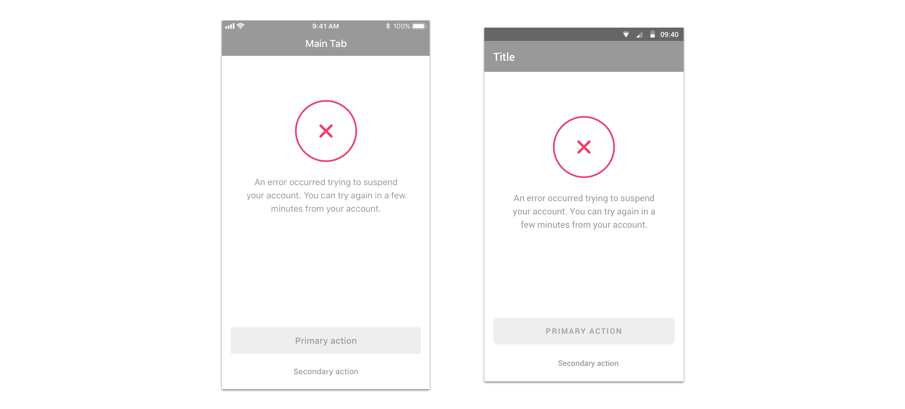

iOS and Android guidelines recommend not using alerts and dialogs too frequently, as they should be reserved for high priority messages we want users to see no matter what. For errors of low importance consider using:

* for iOS a [crouton](../components/ios/crouton.md)
* for Android a [snackbar](../components/android/snackbar.md)
* for web a [snackbar](../components/web/snackbar.md)

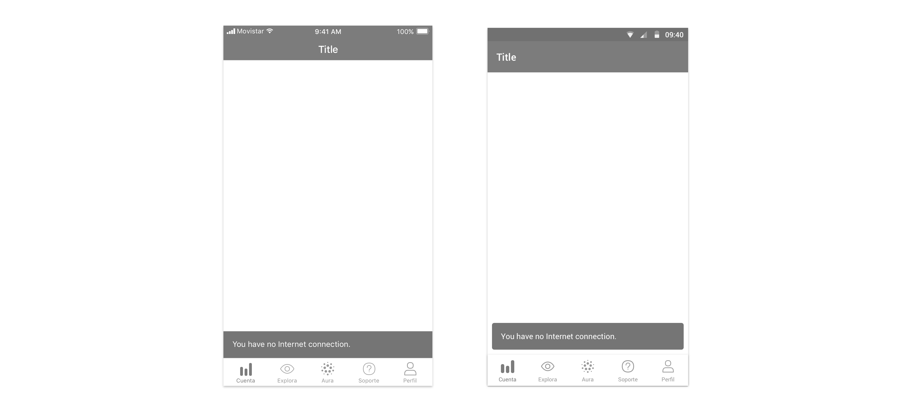

We define low importance errors as those that don’t deal with sensitive information or purchases \(top up’s, upgrades, passwords…\), for instance a language setting that couldn't be changed or a new group conversation name that couldn’t be set.

## System message

### Definition

We define system messages as those that communicate information that is related to the state of the device and are usually transversal to all sections of the product. for instance, messages related with the lack of connectivity belong to this category.

### Component use

Please use:

* For iOS a [crouton](../components/ios/crouton.md)
* For Android a [snackbar](../components/android/snackbar.md)
* For web a [snackbar](../components/web/snackbar.md)

## Informative message

### Definition

We define informative messages as those that contain extra info related with a specific screen users are navigating. The importance of this information may vary, making the component persistent or not, be contextual on the screen or be displayed full screen, and they may or may not include related actions. 

### Component use

Please use:

* For iOS a [banner](../components/ios/banner.md) or [info screen](https://app.gitbook.com/@tef-novum/s/novum/~/drafts/-LtU-1GY-zzIljdw9K5C/design/feedbacks/components/ios/info-screen)
* For Android a [banner](../components/android/banner.md) or [info screen](https://app.gitbook.com/@tef-novum/s/novum/~/drafts/-LtU-1GY-zzIljdw9K5C/design/feedbacks/components/android/info-screen)
* For web a [banner](../components/web/banner.md) or [info screen](https://app.gitbook.com/@tef-novum/s/novum/~/drafts/-LtU-1GY-zzIljdw9K5C/design/feedbacks/components/web/info-screen)

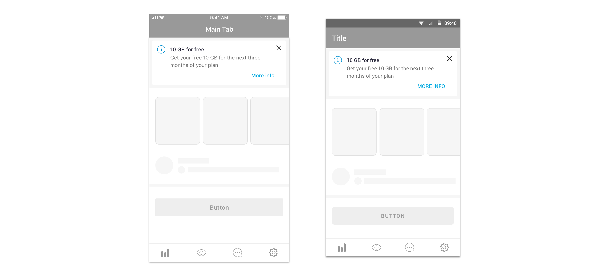

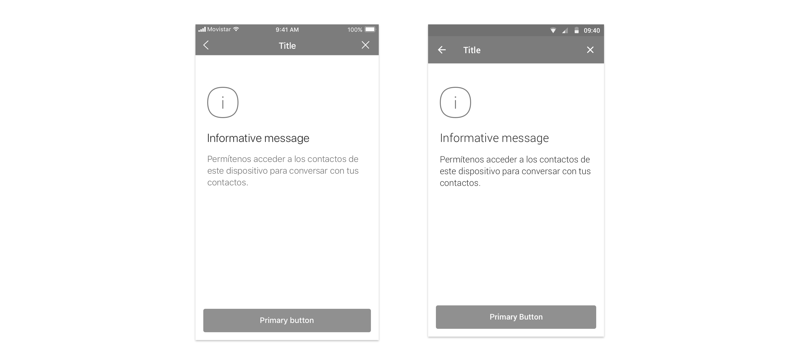
## Action requirement

### Definition

We define action requirements as messages where we need to interrupt users on their current flow and make them perform an action. These messages may or may not be triggered by an action performed by the user: 

* Example 1: We may want to show a message for users to rate our app in the stores  
* Example 2: After triggering an action, we may want users to activate an app permission in order to complete that given action.

### Component use

Please use:

* for iOS an [alert](../components/ios/alert.md)
* for web a [dialog](../components/web/dialog.md)
* For Android use a [dialog](../components/android/dialog.md). If the action is related to device permissions, use the specific format for this: the permission dialog

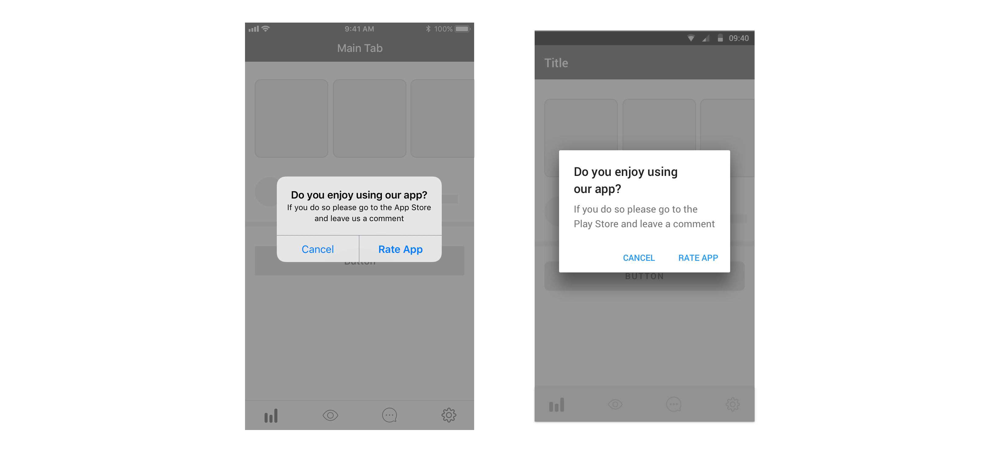

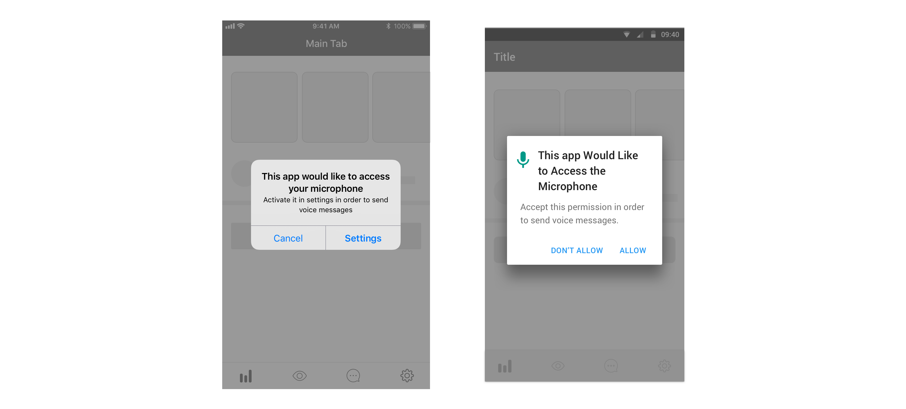

## Action confirmation

### Definition

We define action confirmation as messages where we want users to confirm an action they just previously triggered by giving them extra information or just to confirm they didn’t perform a destructive action by mistake.

### Component use

Please use:

* For Android a [dialog](../components/android/dialog.md)
* For web a [dialog](../components/web/dialog.md)

For iOS we establish two different scenarios and component uses:

For destructive confirmations, meaning those that result in destroying information \(deleting messages, removing images, etc.\) please use [action sheets](../components/ios/action-sheet.md).

For all other types of confirmations, including abandoning multi-step processes while completing them, please use an [alert](../components/ios/alert.md).

## Loading indicator

### Definition

We define loading indicators as components used to convey users information on the load progress of a screen or process.

### Component use

Component use depends on two factors: the estimated loading time of the screen/process and its type.

For cached screens, where we want to convey users that the presented content is being refreshed, please use:

* For iOS a [progress bar](../components/ios/progress-bar.md)
* For Android a [progress bar](../components/android/progress-bar.md)

This is also shown in webviews in browser mode \(check out the documentation for [Android](../../webviews/android/browser.md) and [iOS](../../webviews/ios/browser.md)\)

For new screens, please take into account the estimated loading time of the screen and use the most suitable component:

If the estimated load time is medium \(in the range of 500ms-3s\) and if the layout of the screen allows for it, using skeletons should be the best solution. These may help users interpret the content of the screen in advance and make the impression of a shorter loading time.

Therefore, in this case please use:

* For iOS a [skeleton](../components/ios/skeleton.md)
* For Android a [skeleton](../components/android/skeleton.md)
* For web a [skeleton](../components/web/skeleton.md)

If the estimated load time is very short \(in the range of 0-500ms\) using spinners without any text should be the best solution, as users won’t be able to read any message in such a short time or interpret a skeleton appropriately.

If the estimated load time is very short \(in the range of 0-500ms\) using spinners without any text should be the best solution, as users won’t be able to read any message in such a short time or interpret a skeleton appropriately.

Therefore, in these cases please use:

* For iOS a [spinner](../components/ios/spinner.md)
* For Android a [spinner](../components/android/spinner.md)
* For web a [spinner](../components/web/spinner.md)

We just showcased how to indicate a loading process when navigating between screens. However, sometimes the loading time of a process or action must be shown in the same screen where the action took place. In fact, this is always preferred, as explained when describing error messages, so users can see a possible error in the same screen and edit or retry what necessary.

In these cases, if possible from a design standpoint, a spinner should be shown in the element that triggered the loading indicator \(for example, a button\)

## Form validation

### Definition

We define form validation messages as those where we want to provide users information regarding the completion and errors on input forms.

### Component use

Please use:

* For iOS the [iOS forms](../components/ios/form.md)
* For Android the [Android forms](../components/android/form.md)
* For web the [web forms](../components/web/form.md)

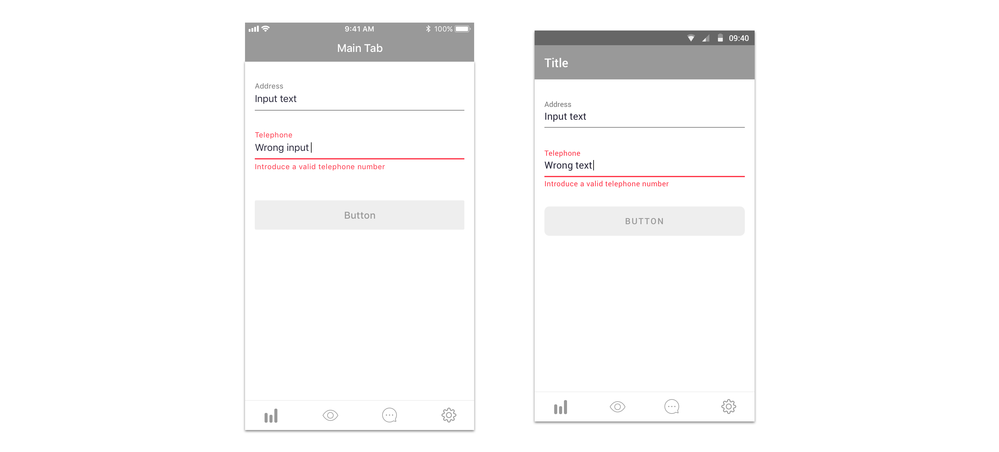

## Contextual guide

### Definition

We define contextual guides as messages around a specific component of the interface, with the intention of giving users more information about their use or simply drawing their attention to them.

### Component use

Please use:

* For iOS a [tooltip](../components/ios/tooltip.md)
* For Android a [tooltip](../components/android/tooltip.md)
* For web a [tooltip](../components/web/tooltip.md)

