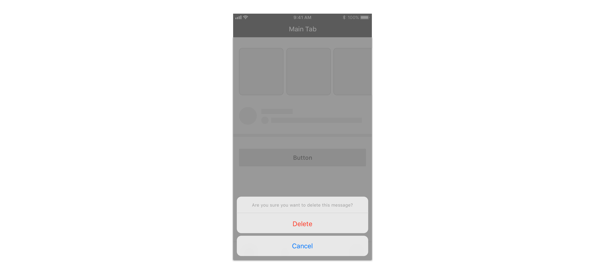
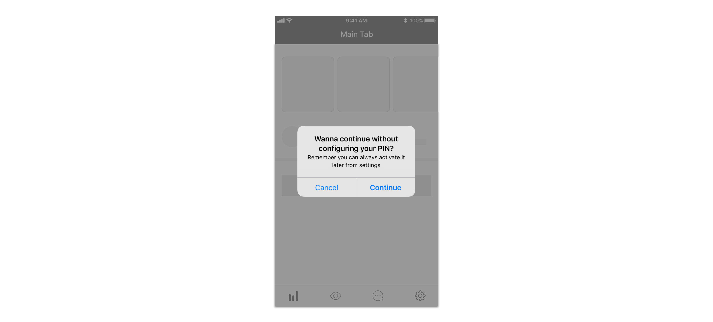

## Definition

We define action confirmation as messages where we want users to confirm an action they just previously triggered by giving them extra information or just to confirm they didn’t perform a destructive action by mistake.

## Component use

Please use:

* For Android a [dialog](../components/android/dialog.md)
* For web a [dialog](../components/web/dialog.md)

For iOS we establish two different scenarios and component uses:

For destructive confirmations, meaning those that result in destroying information \(deleting messages, removing images, etc.\) please use [action sheets](../components/ios/action-sheet.md).

For all other types of confirmations, including abandoning multi-step processes while completing them, please use an [alert](../components/ios/alert.md).

