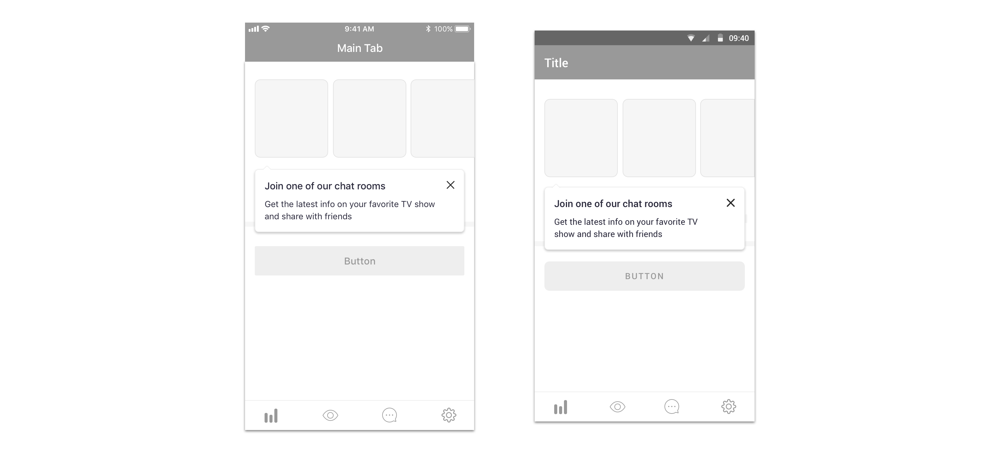

## Definition

We define contextual guides as messages around a specific component of the interface, with the intention of giving users more information about their use or simply drawing their attention to them.

## Component use

Please use:

* For iOS a [tooltip](../components/ios/tooltip.md)
* For Android a [tooltip](../components/android/tooltip.md)
* For web a [tooltip](../components/web/tooltip.md)

