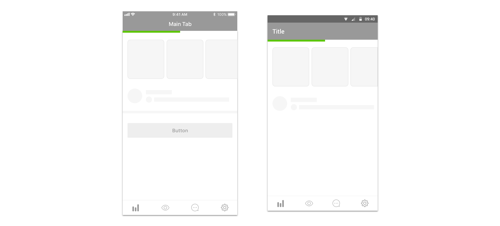
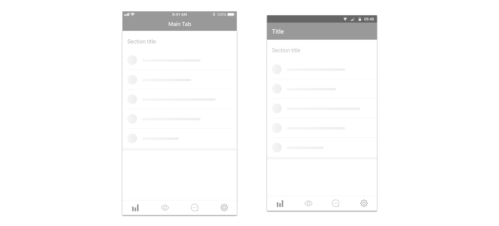
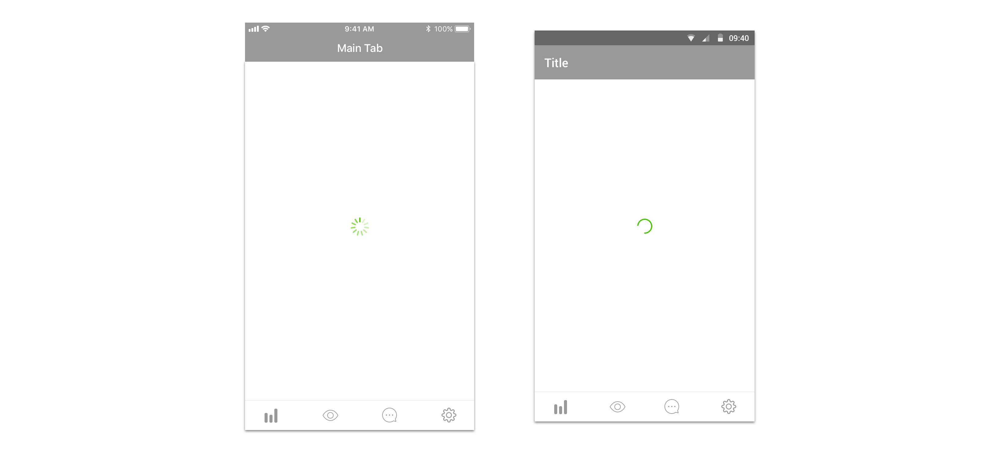
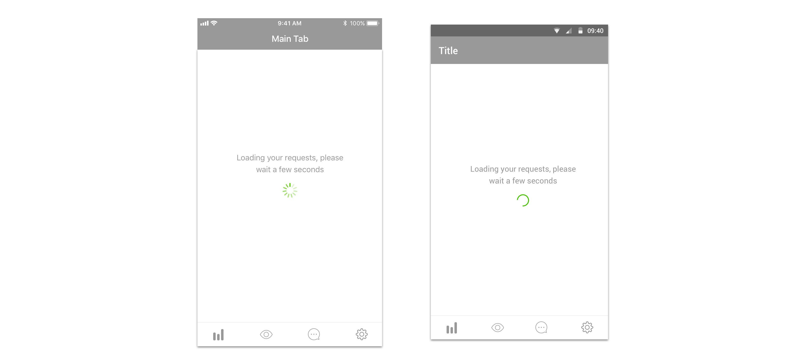
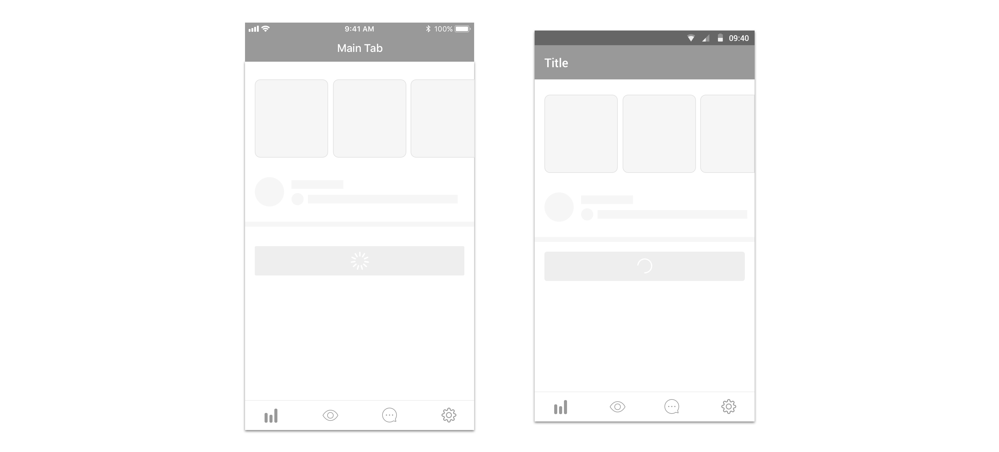

## Definition

We define loading indicators as components used to convey users information on the load progress of a screen or process.

## Component use

Component use depends on two factors: the estimated loading time of the screen/process and its type.

For cached screens, where we want to convey users that the presented content is being refreshed, please use:

* For iOS a [progress bar](../ios/progress-bar.md)
* For Android a [progress bar](../android/progress-bar.md)

This is also shown in webviews in browser mode \(check out the documentation for [Android](../../../design/webviews/android/browser.md) and [iOS](../../../design/webviews/ios/browser.md)\)

For new screens, please take into account the estimated loading time of the screen and use the most suitable component:

If the estimated load time is medium \(in the range of 500ms-3s\) and if the layout of the screen allows for it, using skeletons should be the best solution. These may help users interpret the content of the screen in advance and make the impression of a shorter loading time.

Therefore, in this case please use:

* For iOS a [skeleton](../ios/skeleton.md)
* For Android a [skeleton](../android/skeleton.md)
* For web a [skeleton](../web/skeleton.md)

If the estimated load time is very short \(in the range of 0-500ms\) using spinners without any text should be the best solution, as users won’t be able to read any message in such a short time or interpret a skeleton appropriately.

If the estimated load time is very short \(in the range of 0-500ms\) using spinners without any text should be the best solution, as users won’t be able to read any message in such a short time or interpret a skeleton appropriately.

Therefore, in these cases please use:

* For iOS a [spinner](../ios/spinner.md)
* For Android a [spinner](../android/spinner.md)
* For web a [spinner](../web/spinner.md)

We just showcased how to indicate a loading process when navigating between screens. However, sometimes the loading time of a process or action must be shown in the same screen where the action took place. In fact, this is always preferred, as explained when describing error messages, so users can see a possible error in the same screen and edit or retry what necessary.

In these cases, if possible from a design standpoint, a spinner should be shown in the element that triggered the loading indicator \(for example, a button\)

