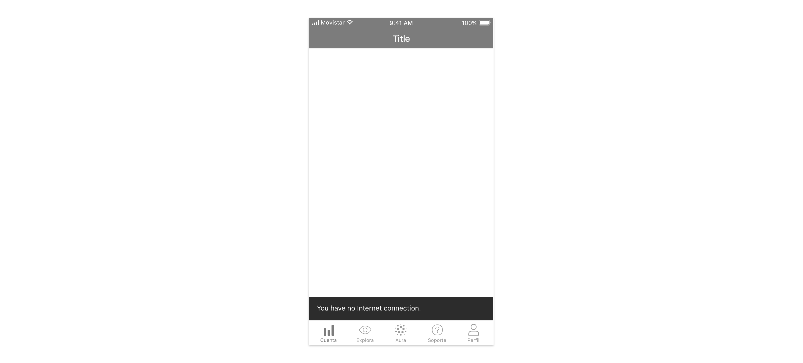

We use croutons for

* [error messages](../feedback-scenarios/error-scenario.mdx)
* [success messages](../feedback-scenarios/success-scenario.mdx)
* [system messages](../feedback-scenarios/system-message.mdx)

## Use considerations

Please use short, descriptive and easy to understand copywriting. Avoid technical jargon and alarming language. Also try to keep messages short enough to fit on one or two lines and keep the component size small enough \(80 characters maximum\).

If a crouton includes an action, please clarify that with the copy included \(for instance: “Message deleted. Tap to undo”\)

Croutons persist for 5 seconds. Users can always dismiss them by swiping up.

More than one crouton can never be shown in the same screen. If more than one crouton need to be shown simultaneously, closing one should trigger showing the next one and so on.

