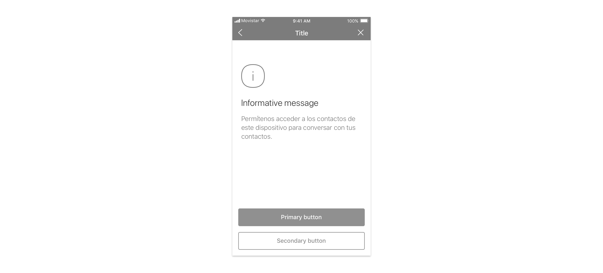

We use info screens for

* [informative message](https://app.gitbook.com/@tef-novum/s/novum/~/drafts/-LtU-1GY-zzIljdw9K5C/design/feedbacks/feedback-scenarios/informative-message)

## Use considerations

Typically use a maximum of two actions to guide users. Always make the most likely one prominent by using a primary button and display the others as a link to make a clear hierarchy.

