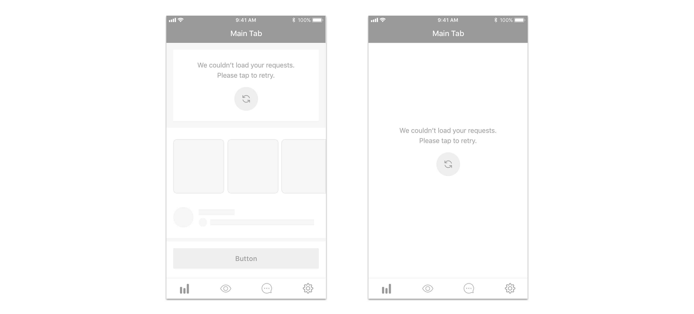

We use load errors for

* [error messages](../feedback-scenarios/error-scenario.mdx)

## Use considerations

If the content that couldn't be loaded is just a part of the whole screen and the latter is still comprehensible and has valuable information regardless, use the module instead of showing the full page error, as long as it's also technically possible.

