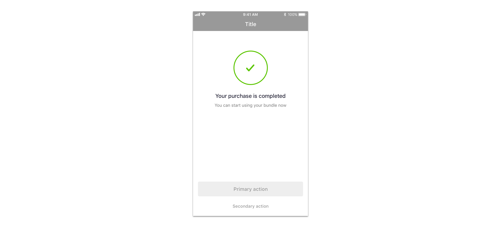

We use success screens for

* [success messages](../feedback-scenarios/success-scenario.mdx)

## Use considerations

Typically use a maximum of two actions to guide users to whatever is best next based on the flow they just completed. Always make the most likely one prominent by using a primary button and display the others as a link to make a clear hierarchy.

