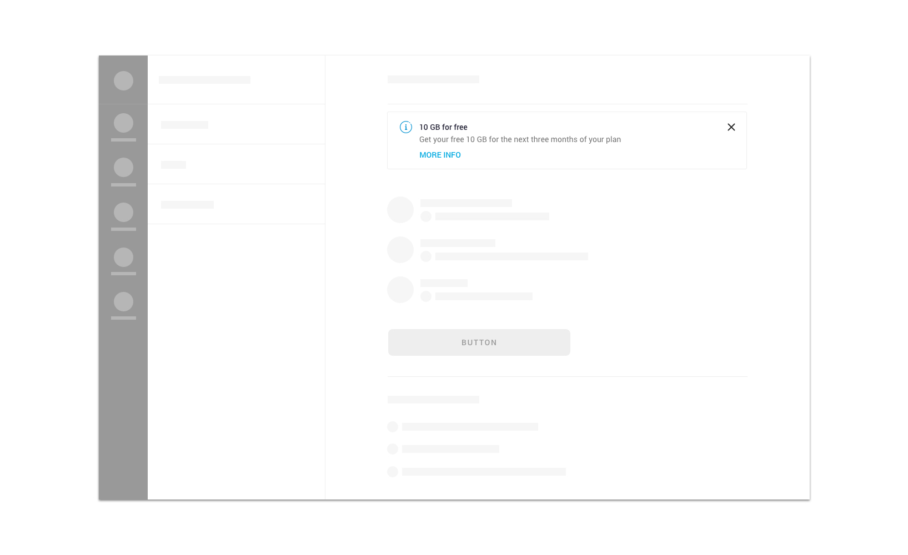

We use banners for

* [informative messages](../feedback-scenarios/informative-message.mdx)

## Use considerations

Please use short, descriptive and easy to understand copywriting. Avoid technical jargon and alarming language. Also try to keep messages short enough to fit into the component size \(100 characters maximum\).

Based on the importance of the message, banners have different subtypes. By default, users can dismiss banners by tapping on the close action. “Critical” banners are an exception to this rule, as they have no close action and therefore persist until users fix an important issue related to them.

