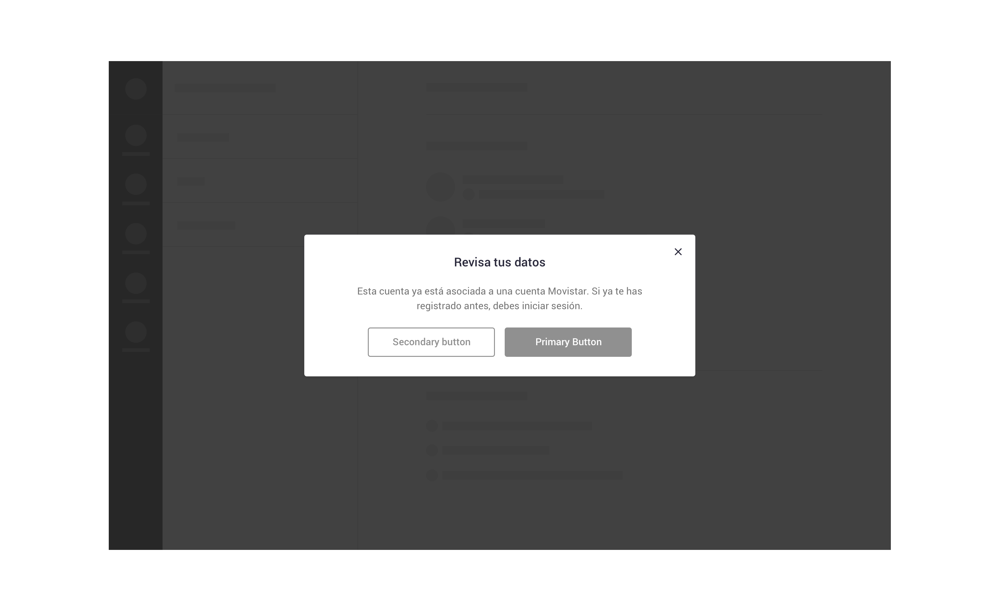

We use dialogs for

* [action confirmations](../feedback-scenarios/action-confirmation.mdx)
* [action requirements](../feedback-scenarios/action-requirement.mdx)
* [error messages](../feedback-scenarios/error-scenario.mdx)

## Use considerations

Generally, use two-button dialogs to provide an easy choice between two alternatives. Cancel buttons should always be on the left. 

For actions, use all caps and no ending punctuation. Use OK for simple acceptance rather than “Accept” or “Continue”. Use “Cancel” for the action that just closes the dialog. If the “Cancel” copy it’s too similar to the alternative action \(“Abandon” for instance\), consider using “Not now” to avoid confusion.

Please use short, descriptive and easy to understand copywriting. Avoid technical jargon and alarming language. Also try to keep messages short enough to fit on one or two lines to prevent scrolling \(80 characters maximum\).

Try to convey all the important information using the title and the actions, as users are likely to read this information only. Use the small text to provide additional but non-essential information.

:::note

We use dialogs when users hasn't acceptance of terms and conditions and wants to continue with a process.
::: 

