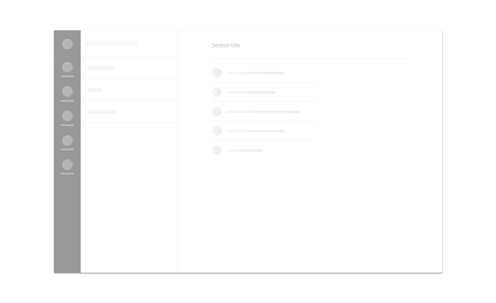

We use skeletons as

* [loading indicators](../feedback-scenarios/loading-indicator.mdx)

## Use considerations

We use skeletons to reduce the perceived load time of a screen. Please take into account that this is suitable for medium expected load times \(500ms-3s\). For shorter load times, users won’t be able to interpret a skeleton correctly, so consider using a spinner instead.

For long expected load times \(3s and on\) you should warn users of how much time the process will take with as much precision as possible, so consider using a spinner with a title instead.

