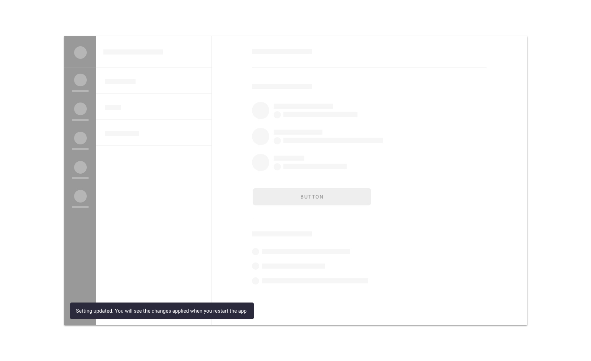

We use snackbars for

* [error messages](../feedback-scenarios/error-scenario.mdx)
* [success messages](../feedback-scenarios/success-scenario.mdx)
* [system messages](../feedback-scenarios/system-message.mdx)

## Use considerations

Please use short, descriptive and easy to understand copywriting. Avoid technical jargon and alarming language. Also try to keep messages short enough to fit on one or two lines and keep the component size small enough.

Snackbars persist for 5 seconds and can’t be dismissed until that time has passed. 

Multiple snackbars can never be shown in the same screen. If more than one snackbar need to be shown simultaneously, closing one should trigger showing the next one and so on.

