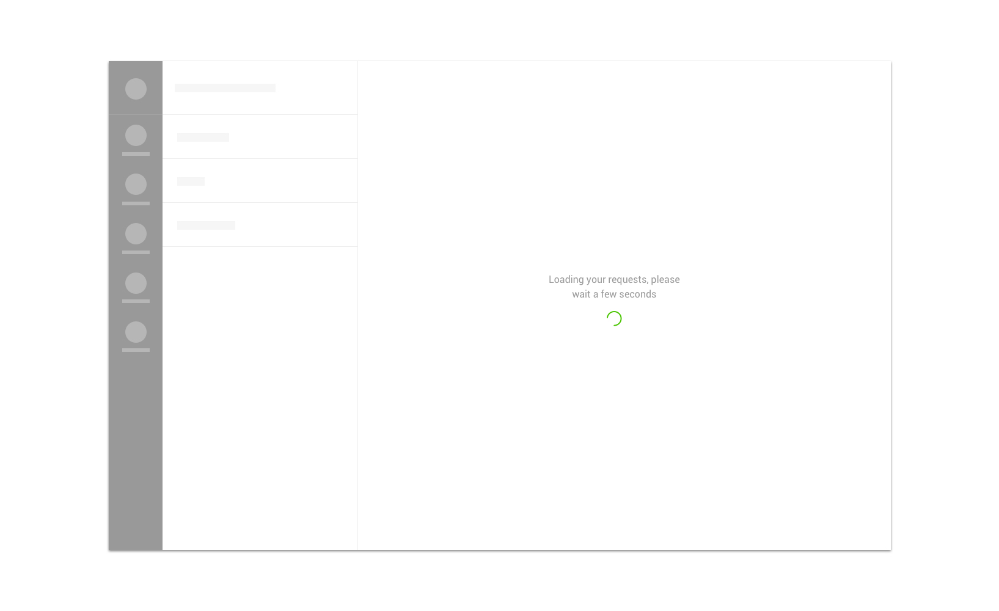

We use spinners as

* [loading indicators](../feedback-scenarios/loading-indicator.mdx)

## Use considerations

Consider using the spinner with or without a title depending on the expected load time. If the expected load time is high enough \(500 ms and on\) for users to be able to read it, you should include a title with the spinner. This is critical for very high expected load times \(3s and on\), where you should prevent users indicating the expected load time with as much precision as possible \(for instance, favor using “a minute” over “a while”\).

