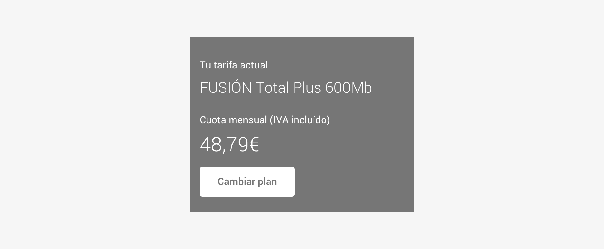
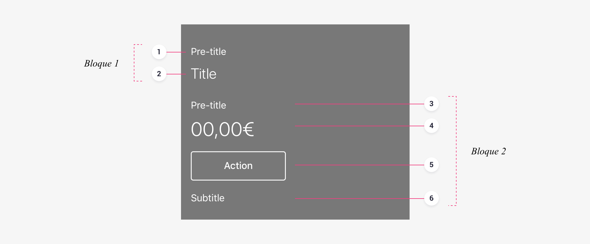
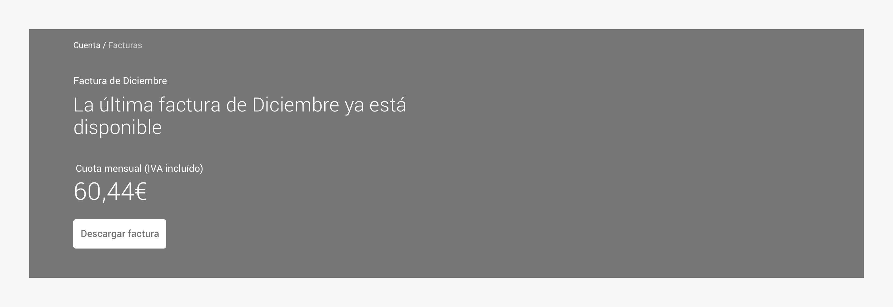
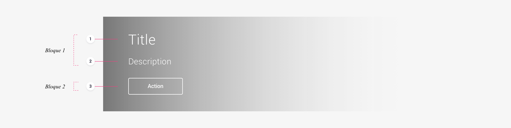
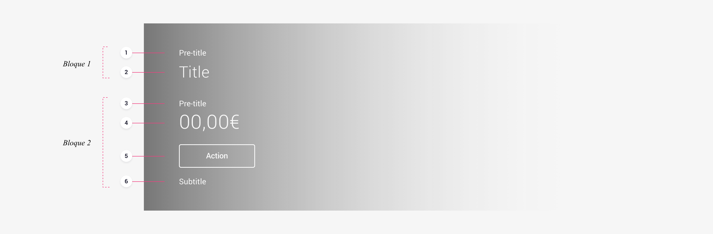

<MultiBrandExample>
    <HeaderLayout
        header={
            <Header
            title="La última factura de diciembre ya esta disponible"
            preamount="Cuota mensual (IVA incluido)"
            amount="60,44 €"
            button={<ButtonPrimary href="asdf">Descargar factura</ButtonPrimary>}
            subtitle="Y esto es un subtitulo"
            />
        }
        extra={<Placeholder />}
    />

</MultiBrandExample>

 
    
 

# Use

A header serves to **highlight relevant content** or **serve as a guide** for the user, either giving greater emphasis to content within the context of a page or as additional information to the content that will then be presented to the user.

## Language type

When designing a header, we must ask ourselves two questions: what do we want to communicate and how do we want to do it?

The modularity of elements allows us to use these headers to help users quickly understand information \(or simplify more complex information\) and display the main actions of a screen.

The content presented may vary depending on the purpose of the screen that we are designing and the intention with which we want to communicate with users.

We use various elements to build these headings and help us communicate the message in the best way possible, with the body of text being the only mandatory element.

The type of language we use will range from a more functional language to a more conversational one, which establishes a dialogue with the user.

### Functional structure

We can build functional headers in which the elements are arranged in a structured way, allowing the user to identify them quickly and independently.

### Conversational structure

Alternatively, we can design more organic content utilising conversational language, where the user is provided with all of the information of the message in the same sentence.

# Structure

## App

### Anatomy

Conceptually, a header is made up of two blocks of related information, with these blocks being made up of different elements. We can use six different elements to communicate a message. Of these six, only the _Title_ is mandatory in the construction of headers.

_Block 1_

* **Pre-title** \(optional\) The pre-title provides the necessary context to understand the title.
* **Title** \(mandatory\) The title provides the main message that we want to communicate to users.

_Block 2_

* **Pre-title** \(optional\) The pre-title provides the necessary context to understand the information provided by this second block.
* **Amount** \(optional\) The amount is used to represent quantities \(money, gigabytes, etc.\)
* **Action** \(optional\) This is an interaction element. It allows users to take immediate action and decisions based on contextualised information.
* **Subtitle** \(optional\) The subtitle amplifies the information contained in the header, providing further information that is also relevant to the user.

## Website

### Typology

On the website we lack the _Navigation Bar_ component, and therefore its _Large_ version that we use in the main tabs of our product's app. Due to the need to have a type of header that transfers the composition and visual weight of the app's Large Navigation Bars to the main sections of desktop site, we differentiate between:

* **Main Tab Header** The Main Tab Header is equivalent to the Large Navigation Bars in the app
* **Common Header** The Common Header is equivalent to the Headers in the app

### Main tab header

#### Anatomy

Conceptually, a _Main Tab Header_ is made up of two blocks of related information, with these blocks being made up of different elements. There are three elements with which we can communicate a message. Of these three elements, only the _Title_ is mandatory in the construction of headers.

_Block 1_

* **Title** \(mandatory\) The title provides the main message that we want to communicate to users.
* **Description** \(optional\) The description amplifies the information.

Block 2

* **Action** \(optional\) This is an interaction element. It allows users to take immediate action and decisions based on contextualised information.

### Common header

#### Anatomy

As with the app, a _Common Header_ is conceptually made up of two blocks of related information, with these blocks being made up of different elements. There are six elements with which we can communicate a message. Of these six elements, only the _Title_ is mandatory in the construction of headers.

_Block 1_

* **Pre-title** \(optional\) The pre-title provides the necessary context to understand the title.
* **Title** \(mandatory\) The title provides the main message that we want to communicate to users.

_Block 2_

* **Pre-title** \(optional\) The pre-title provides the necessary context to understand the information provided by this second block.
* **Amount** \(optional\) The amount is used to represent quantities \(money, gigabytes, etc.\)
* **Action** \(optional\) This is an interaction element. It allows users to take immediate action and decisions based on contextualised information.
* **Subtitle** \(optional\) The subtitle amplifies the information contained in the header, providing further information that is also relevant to the user.

