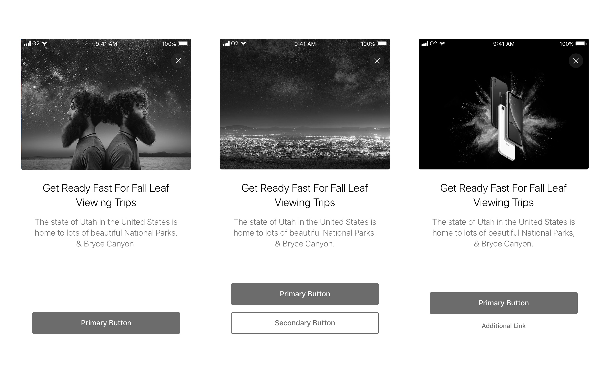
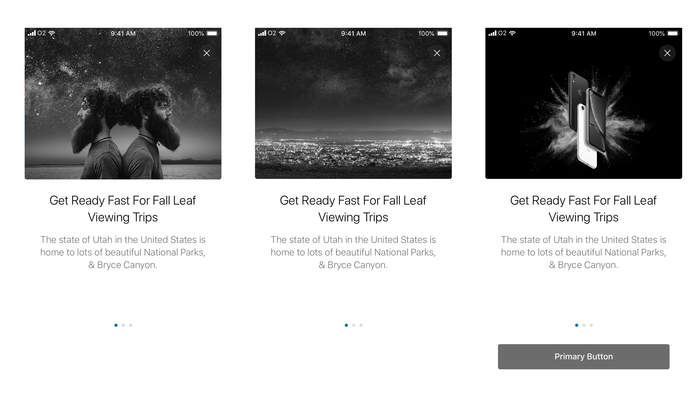
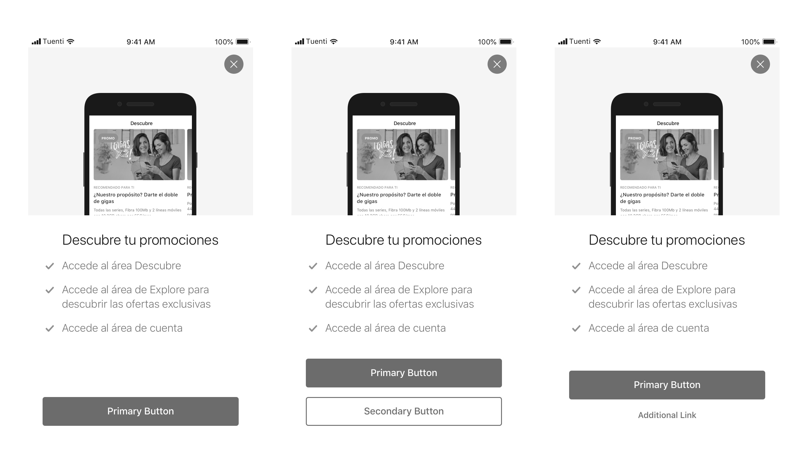

An in-app message is a message represented by a full-screen modal used to acknowledge users about new or revamped features within the app for whom they are segmented.

### What is an In-App?

An in-app message is a message represented by a full-screen modal used to acknowledge users about new or revamped features within the app for whom they are segmented. This means that the message should be **understandable**, **representative** and **achievable** by the segmented user.

### What is NOT an In-App?

An in-app message is not an element that indicates anything related about new information associated with an existing component or feature in the app nor new marketing promotions. For that goal, there’s another series of component that can be used with that purpose
****

## Usage examples

\* Replacement of the MyO2 Classic app to MyO2 NOVUM, with new features.

\* Launch a new functionality, such as Order Tracking and inform the users about this new feature.

\* Move support from top bar navigation to the main app bar and inform the users about this change.

## Layouts available

### Single Card

The single card message is the default layout used to explain a new feature in a concise and specific way.

* Header image
* Title
* Subtitle
* Action \(1 Button / 2 Buttons / 1 Button + Link\)

### Slideshow

The slideshow message is the available layout used to explain a series of specific new features that are related to each other or a new feature which is complex and needs more space for more content.

* Header image
* Title \(One for each card\)
* Subtitle \(One for each card\)
* Previous card \(Back button / No button\)
* Last card \(1 Button / 2 Buttons / 1 Button + Link\)

### Bullet list

A bullet message is an option used only when the single card is not enough and highlight the key points of the feature in a more scannable way for the user.

* Header image
* Title 
* Checks \(Up to 3\)
* Action \(1 Button / 2 Buttons / 1 Button + Link\)

## Modes available

### First Access

Also called "Onboarding". The message is displayed to the user when they access the app for the first time.

### Global

The message is displayed to the user when they access the app but they have been logged in at some point in the app.

### Navigation

The message is displayed to the user when they tap on a specific tab from the app \(Explore, Account, Support ...\)

\*\*\*\*

