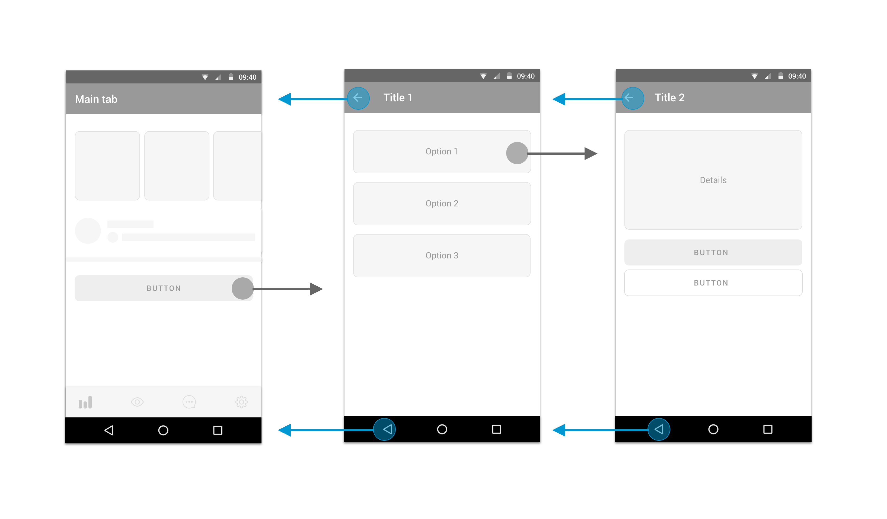
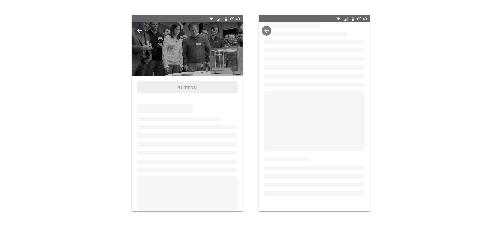

## Description

From the user’s point of view this flow imitates the native behaviour.

We use this type of webview by default throughout the app unless we face a flow with special needs that fits better with a modal or browser flow \(see in the following sections\).

## **Applications**

### **1. Standard Nested Flow**

Where we just want to keep the native behaviour.

### **2. Internal purchase flow or funnel**

Critical internal flows where we don’t want the user to leave in an easy way.  

## **Behaviour**

### **Back behaviour**

Navigation bar back and native back are chronological \(back one step\)

### **Entrance transition**

Given by the system \(Android version\)

### **Progress indicator**

Android circular progress indicator with brand color + generic text

### Error

No connection text + tap to reload button for connection errors  
Generic text + tap to reload button for other errors

### Title

Once the webview finishes loading it will use the title from the &lt;title&gt; html tag \(document.title\) to populate the title in the navigation bar.

It could be modified using the web view javascript bridge message SET\_TITLE.

## Screen Configuration

### Bottom nav

Not configurable - Always false.

### Nav bar

True - by default

False - when an image is designed to reach the top of the screen.   
Actions keep floating when user scrolls down

## Useful links

How is it in iOS?



  
Related technical documentation 



