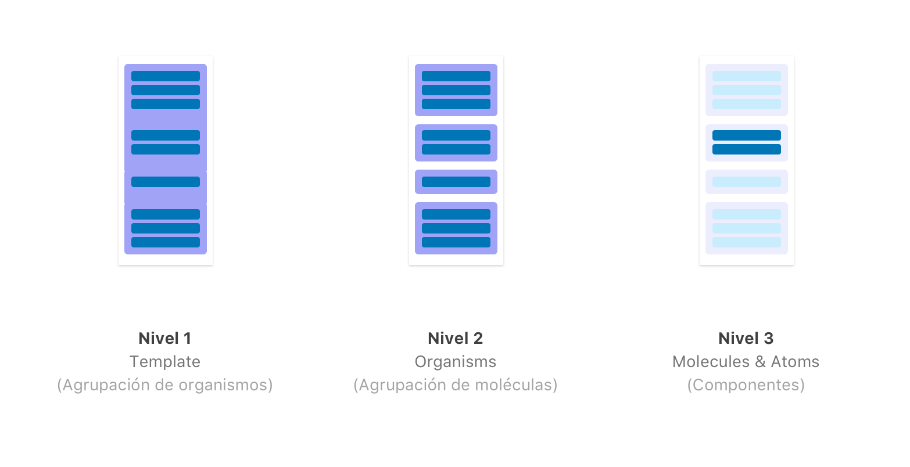
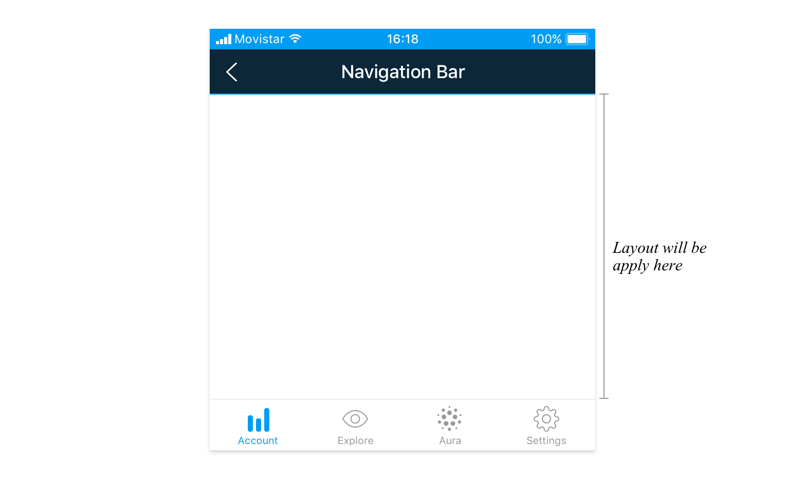
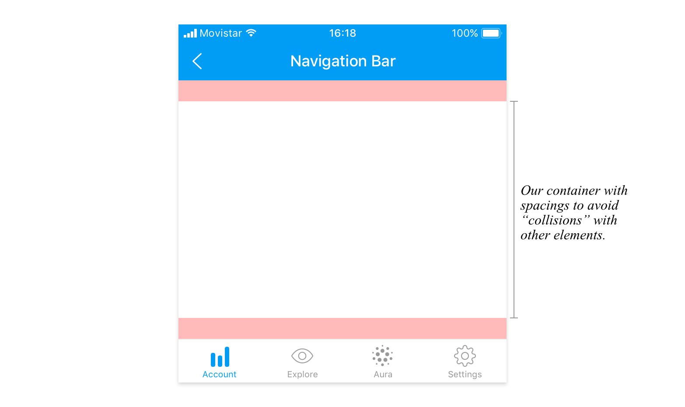
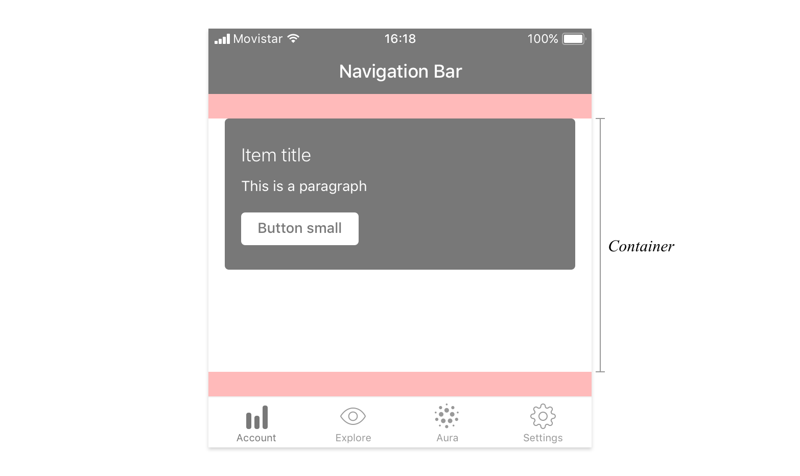
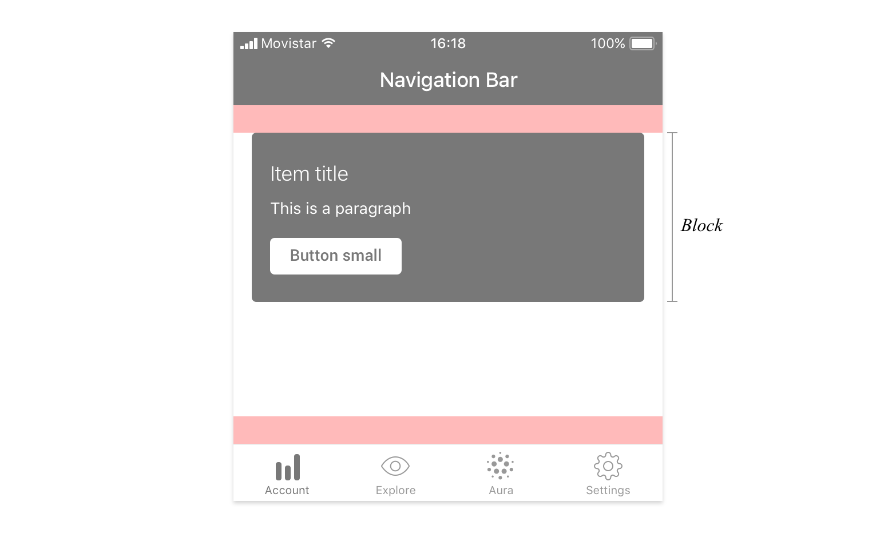
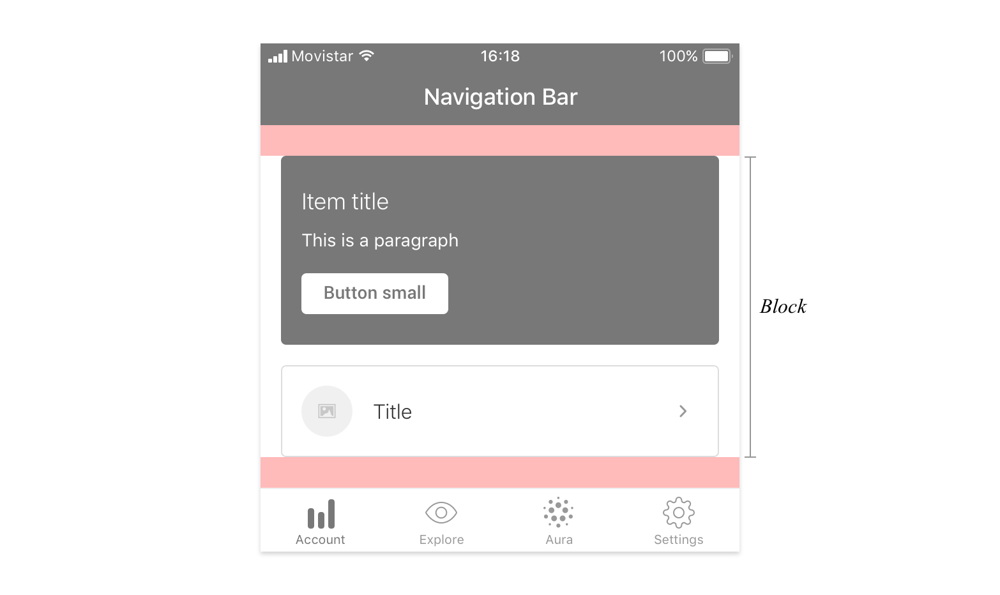
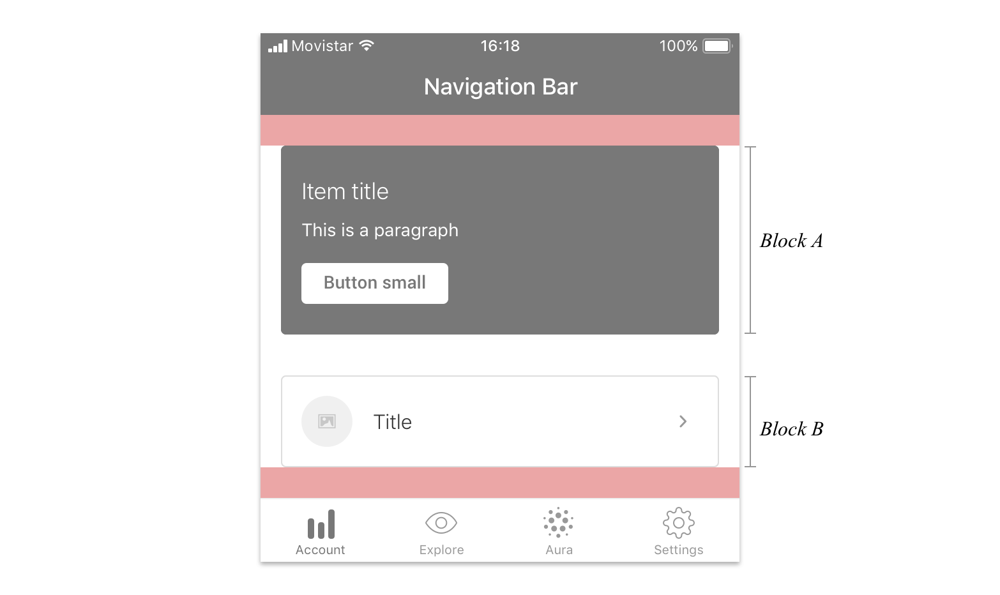
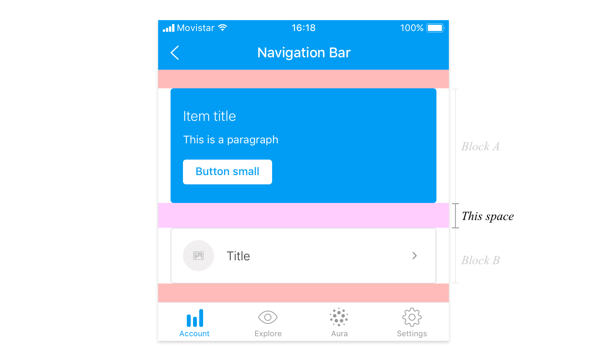
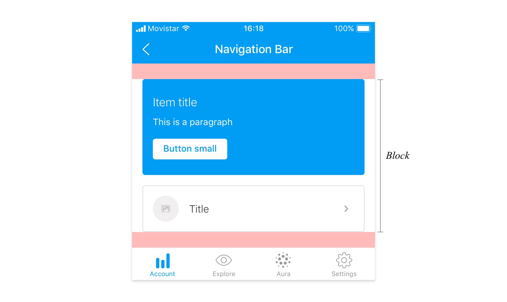
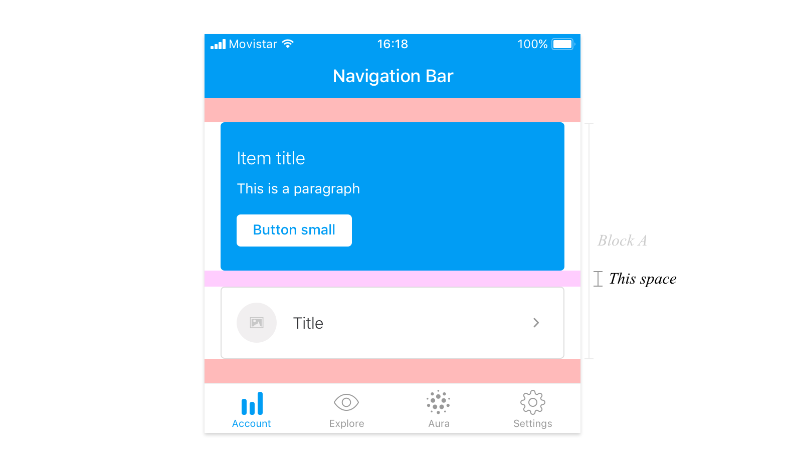

## ¿Qué son layouts?

Los layouts son estructuras de espacios que ayudan a distribuir los componentes en diferentes pantallas.

## ¿Para qué sirven los layouts?

El objetivo de un layout es marcar el ritmo vertical en la distribución de los componentes en la pantalla y proporcionando consistencia en las pantallas de todos los productos que utilizan nuestro sistema de diseño. Tanto en diseño como en desarrollo ayudará a construir pantalla de manera más ágil.

## ¿Cómo se utilizan?

Un layout está formado por diferentes tipos de espacios.

1. Espacio exterior al contenedor del layout
2. Espacio entre bloques dentro del contenedor
3. Espacio entre elementos dentro de un bloque

### \[LVL 1\] Espacio exterior del contenedor

Llamamos “contenedor del layout” a todo el grupo de bloques y componentes donde se le está aplicando el layout. Por ejemplo, en esta pantalla, estamos aplicando el layout a la zona con fondo blanco.

Éste área tiene por defecto unos espacios asignados, que como se ha explicado anteriormente, ayudarán a que los componentes se coloquen creando ese ritmo vertical.

El primer espacio que tendrá este contenedor es el espacio que separa el primer componente que metamos con elementos que no formen parte de este contenedor por la parte superior. Del mismo modo, tendremos el mismo espacio en la parte inferior, para que ningún componente se pegue a la parte inferior de la pantalla y por ejemplo, “choque” con una TabBar.


Este espacio, es definido en desarrollo como **&lt;Box&gt;** y podría ser entendido como un margen del contenedor


En este punto, si metemos un componente, se distanciará de la navbar.

En cuanto metemos este primer componente, automáticamente se nos genera lo que vamos a llamar a partir de ahora **BLOQUE.**

Un **Bloque** es simplemente un grupo de componentes relacionados y agrupados entre sí.

Al meter un segundo componente se pueden tomar 2 decisiones.

**Meterlo dentro del mismo bloque que el componente que acabamos de meter**

**Meterlo como un bloque diferente.**

Ésta decisión es importante, porque dependiendo de cómo se organicen las pantalla, los componentes se distanciarán más o menos entre ellos, esto ayudará al usuario en la organización de información en la interfaz.

### \[LVL 2\] Espacios entre bloques

El espacio entre bloques sería la distancia visual entre diferentes bloques \(Bloque A - Bloque B\). El espaciado entre bloques será siempre de 32px, y no podrá ser modificado.


Un diseñador o diseñadora podrá hacer cuantos bloques necesite sin importar el número de componentes dentro de cada bloque.



A este espacio entre elementos, en desarrollo se le conoce con la etiqueta **&lt;Stack&gt;**


### \[LVL 3\] **Espacio entre elementos dentro de un bloque**

Los elementos que se encuentran dentro de un bloque tendrán a su vez unos espacios definidos entre ellos. Volviendo al ejemplo de 1 solo bloque con dos componentes en su interior.

Cada componente que esté dentro de un bloque se separará 16px entre componente y componente

### Resumen

* Distancia del contenedor por arriba y por debajo **24px**
* Distancia entre bloques **32px**
* Distancia entre componentes dentro de un bloque **16px**

Hasta aquí, la definición por defecto de layouts.

## Layouts en Desktop

Aplicaremos la misma definición de "niveles" que hemos explicado [anteriormente](https://app.gitbook.com/@tef-novum/s/novum/design/fundamentals/layouts#como-se-utilizan).

Solo cambiarán las distancias relativas a cada elemento.

* Distancia del contenedor por arriba es de **40px** y por debajo de **80px**
* Distancia entre bloques **56px**
* Distancia entre componentes dentro de un bloque **24px**

## Otros recursos



[Zeplin con las especificaciones técnicas](https://app.zeplin.io/project/5d653c69f828bf7299c551c1/screen/5f1e9e3eab9a393acc54f8fa/)



En este archivo de Origami, se puede ver como funciona un layout de manera automática.





