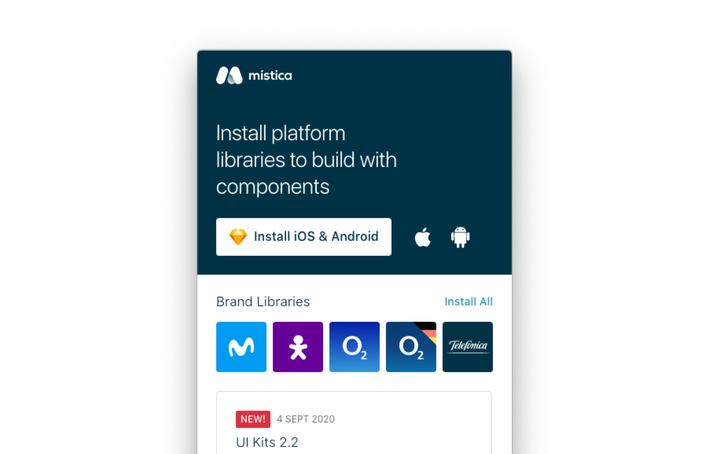

Hemos desarrollado un conjunto de herramientas para que los diseñadores de los diferentes equipos puedan conseguir consistencia entre productos de Telefónica.  

Entre ellas encontramos:
* Librerías de Sketch con todos los componentes disponibles de código
* Documentación de uso de componentes, disponible en la pestaña [Components](../components/introduction.mdx)
* Specs de creación de los componentes para desarrollo en [Zeplin](https://zpl.io/VqL93vZ)

## Sketch libraries
Para acceder a estas librerías tendrás que descargar un pequeño programa que te ayudará a instalarte todo lo necesario.

### Mística Manager
Este pequeño programa te permitirá:
* Instalar las diferentes tipo de librerías en Sketch
    * Librerías de plataformas (iOS / Android / Desktop) 
    * Librerías de marca (Movistar, Vivo, O2, ClassicO2 y Telefónica)
    * Librería de iconos

Además te permitirá descargar recursos necesarios como:
* Tipografías nativas y de Telefónica
* UI Kits con todos los componentes ordenados
* Instalar el plugin Camilo con el que podrás cambiar entre una marca y otra con un solo click!

 

<ThemeContextProvider theme={{skin: 'Movistar'}}>
<ButtonLayout align="center">
<ButtonPrimary href="https://www.dropbox.com/sh/jdy0hyf6b8gz5oe/AADz5uXewug_bDH5_fbRPx6Ya?dl=1" newTab>Download Mística Manager</ButtonPrimary>
</ButtonLayout>
</ThemeContextProvider>

 

