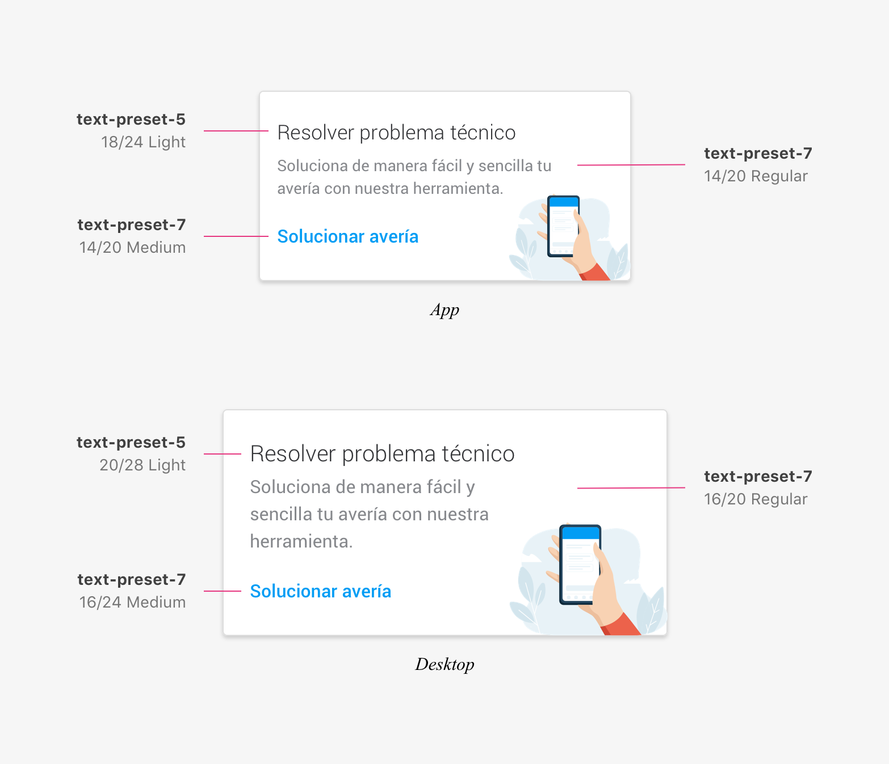
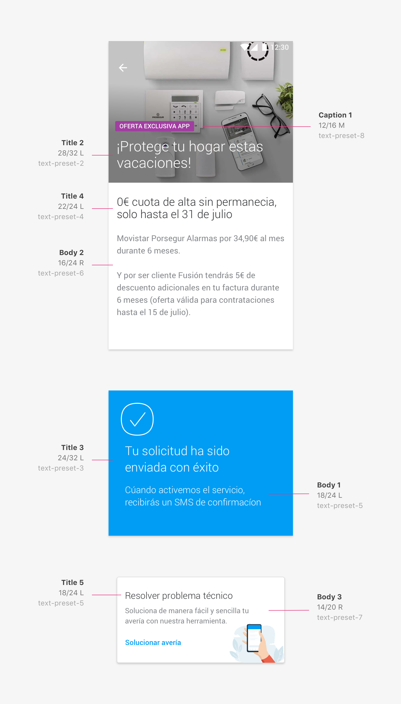

#### Mística cuenta con 8 estilos tipográficos, a los que denominamos _text-presets_ y que se ordenan del 1 al 8 en una escala de mayor a menor respectivamente.

## ¿Qué son los _text-presets_?
La nomenclatura _text-presets_ nos permite que estos estilos sean reutilizables en diferentes pantallas y contextos sin importar su ubicuidad. A su vez posibilitan crear una relación de tamaños entre los diferentes formatos y dispositivos con los que diseñamos; móvil, escritorio, TV, … de esta manera podemos abarcar distintos contenidos y necesidades de un producto.

## Text style

Nuestro sistema tipográfico utiliza las fuentes de los sistemas operativos móviles:
- Dispositivos Apple **San Francisco** 
- Dispositivos Android **Roboto**

Para desktop, ya sea PC o Mac, utilizaremos la fuente **Roboto**.
 

Actualmente dimensionamos nuestros estilos tipográficos, _text-presets_, en dos grupos; **App y Desktop**.

### Tabla de correspondencias tipográficas
Los tamaños que se muestran a continuación corresponden al tamaño y la altura de la línea:

 

|                   |      App      |    Desktop    |
| :---------------- | :-----------: | :-----------: |
| **text-preset-1** |  32/40 Light  |  40/48 Light  |
| **text-preset-2** |  28/32 Light  |  40/48 Light  |
| **text-preset-3** |  24/32 Light  |  32/40 Light  |
| **text-preset-4** |  22/24 Light  |  28/32 Light  |
| **text-preset-5** |  18/24 Light  |  20/28 Light  |
|                   | 18/24 Medium  | 20/28 Medium  |
| **text-preset-6** |  16/24 Light  |  18/24 Light  |
|                   | 16/24 Regular | 18/24 Regular |
|                   | 16/24 Medium  | 18/24 Medium  |
| **text-preset-7** | 14/20 Regular | 16/24 Regular |
|                   | 14/20 Medium  | 16/24 Medium  |
| **text-preset-8** | 12/16 Regular | 14/20 Regular |
|                   | 12/16 Medium  | 14/20 Medium  |

 

#### Ejejemplo de _text-presets_ aplicados a una Highlighted Card

:::info
 Este sistema también esta preparado para productos que utilicen la tipografía corporativa **Telefónica** en uno o ambos entornos. En estos casos el tamaño aumentara en 1 punto en todos los _presets_.

 Por ejemplo, un _text-preset-1_ tendría los siguientes valores: 
 **App 33/40 Light** y **Desktop 41/48 Light**
:::
 

## Combinando _text-presets_
Como veíamos más arriba los _text-presets_ nos permiten que los estilos sean reutilizables en diferentes pantallas y contextos sin importar su ubicuidad. Esto quiere decir que por ejemplo, un _text-preset-5_ (18 Light), se pueda usar tanto como _Title_, o como _Body_.

Por eso, a la hora de diseñar hemos definido una jerarquía que nos ayude a combinar los diferentes estilos de una manera lógica.

:::note
Esta jerarquía esta disponible a modo de componentes de texto desde las Librerías de Mística y solo aplica a diseño. Desde desarrollo solo utilizarán _text-presets_. 
:::
### Titles
Por definición los títulos son los textos más grandes que se presenta en la pantalla, reservado para dar información concisa e importante. Si es cierto que el rango de 1 a 6 títulos nos permite contemplar tamaños más pequeños pero con una intención muy definida, como el _Title 6_ que aplica al componente [section title](https://telefonica.github.io/mistica/docs/components/texts/section-title).

| **Titles**        |      App      |    Desktop    |  text-preset  |
| :---------------- | :-----------: | :-----------: | :-----------: |
| Title 1           | 32/40 Light   |  40/48 Light  | text-preset-1 |
| Title 2           | 28/32 Light   |  40/48 Light  | text-preset-2 |
| Title 3           | 24/32 Light   |  32/40 Light  | text-preset-3 |
| Title 4           | 22/24 Light   |  28/32 Light  | text-preset-4 |
| Title 5           | 18/24 Light   |  20/28 Light  | text-preset-5 |
| Title 6           | 12/16 Medium  |  14/20 Medium | text-preset-8 |

 

### Subs
Su uso se reserva para títulos de énfasis medio. Estos se pueden encontrar en listas, o cards con un menor peso visual dentro de la interfaz por ejemplo.

| **Subs**          |      App      |    Desktop    |  text-preset  |
| :---------------- | :-----------: | :-----------: | :-----------: |
| Sub 1             | 16/24 Light   | 18/24 Light   | text-preset-6 |
| Sub 2             | 14/20 Regular | 16/24 Regular | text-preset-7 |

 

### Bodys
Para cuerpos de texto, se presenta en rangos _body1, body2, body3 y body4_ y, por lo general, su uso variará dependiendo de si este se presenta en una card, en una módal o pantalla más informativa o en escritura de largo formato dentro de una pagina de contenido.

| **Bodys**         |      App      |    Desktop    |  text-preset  |
| :---------------- | :-----------: | :-----------: | :-----------: |
| Body 1            | 18/24 Light   |  20/28 Light  | text-preset-5 |
| Body 2            | 16/24 Regular | 16/24 Regular | text-preset-6 |
| Body 3            | 14/20 Regular | 16/24 Regular | text-preset-7 |
| Body 4            | 12/16 Regular | 14/20 Regular | text-preset-8 |

 

### Caption
Son los tamaños de fuente más pequeña y proporcionan información detallada en situaciones en las que el contenido es compacto o se cuenta con un espacio reducido.

| **Caption**       |      App      |    Desktop    |  text-preset  |
| :---------------- | :-----------: | :-----------: | :-----------: |
| Caption 1         | 12/16 Medium  | 14/20 Medium  | text-preset-8 |

 

#### Ejemplos de combinaciones aplicadas a diferentes pantallas y componentes

