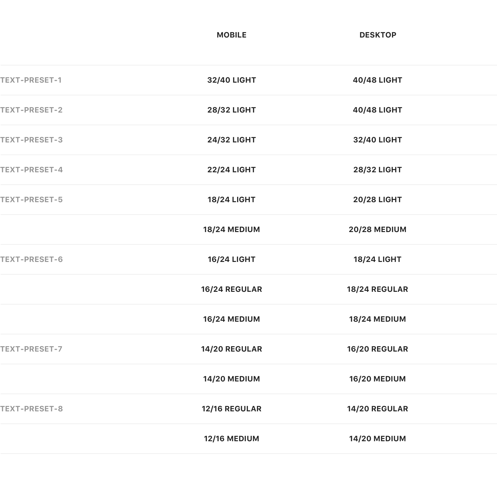

#### Mística cuenta con 8 estilos tipográficos, a los que denominamos _text-presets_ y que se ordenan del 1 al 8 en una escala de mayor a menor respectivamente.

## ¿Qué son los text-presets?
La nomenclatura _text-presets_ nos permite que estos estilos sean reutilizables en diferentes pantallas y contextos sin importar su ubicuidad. A su vez posibilitan crear una relación de tamaños entre los diferentes formatos y dispositivos con los que diseñamos; móvil, escritorio, TV, … de esta manera podemos abarcar distintos contenidos y necesidades de un producto.

## Text style

Nuestro sistema tipográfico utiliza las fuentes de los sistemas operativos móviles:
- Dispositivos Apple **San Francisco** 
- Dispositivos Android **Roboto**

Para desktop, ya sea PC o Mac, utilizaremos la fuente **Roboto**.
 

Actualmente dimensionamos nuestros estilos tipográficos, _text-presets_, en dos grupos; **App y Desktop**.

### Tabla de correspondencias tipográficas
Los tamaños que se muestran a continuación corresponden al tamaño y la altura de la línea:

 

|                   |      App      |    Desktop    |
| :---------------- | :-----------: | :-----------: |
| **text-preset-1** |  32/40 Light  |  40/48 Light  |
| **text-preset-2** |  28/32 Light  |  40/48 Light  |
| **text-preset-3** |  24/32 Light  |  32/40 Light  |
| **text-preset-4** |  22/24 Light  |  28/32 Light  |
| **text-preset-5** |  18/24 Light  |  20/28 Light  |
|                   | 18/24 Medium  | 20/28 Medium  |
| **text-preset-6** |  16/24 Light  |  18/24 Light  |
|                   | 16/24 Regular | 18/24 Regular |
|                   | 16/24 Medium  | 18/24 Medium  |
| **text-preset-7** | 14/20 Regular | 16/24 Regular |
|                   | 14/20 Medium  | 16/24 Medium  |
| **text-preset-8** | 12/16 Regular | 14/20 Regular |
|                   | 12/16 Medium  | 14/20 Medium  |

 

:::note
 Este sistema también esta preparado para productos que utilicen la tipografía corporativa **Telefónica** en uno o ambos entornos. En estos casos el tamaño aumentara en 1 punto en todos los _presets_.

 Por ejemplo, un _text-preset-1_ tendría los siguientes valores: 
 **App 33/40 Light** y **Desktop 41/48 Light**
:::

#### Titles
#### Subs
#### Bodys
#### Caption
Son los tamaños de fuente más pequeña y proporcionan información detallada en situaciones en las que el contenido es compacto o se cuenta con un espacio reducido.

This is a link to other page This is a link to an [external page.](http://www.example.com/)
