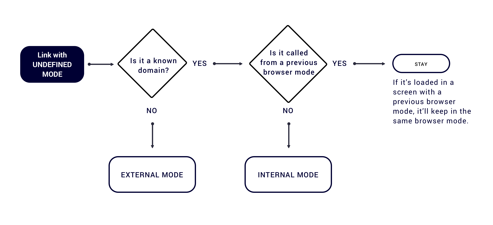
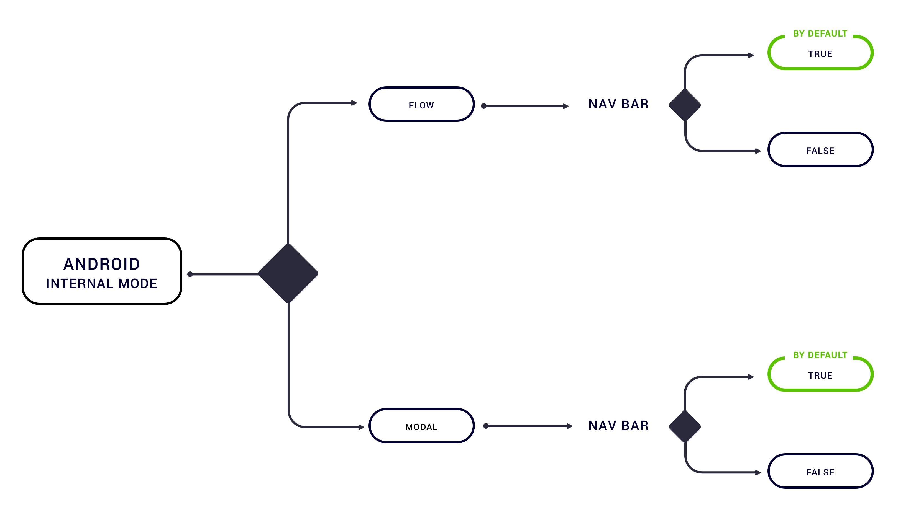

Webview modes and presentations will be inserted in the URL as a parameter.   
When no parameters are found in the URL in order to perform a demanded mode, a mode and transition by default will be applied. 

By default scenarios for **undefined mode**:  
\(common in both platforms\)

**Given an internal mode**, by default scenarios for **undefined presentation**:  
\(common in both platforms\)

**Given an internal mode**, configurable options by default:

