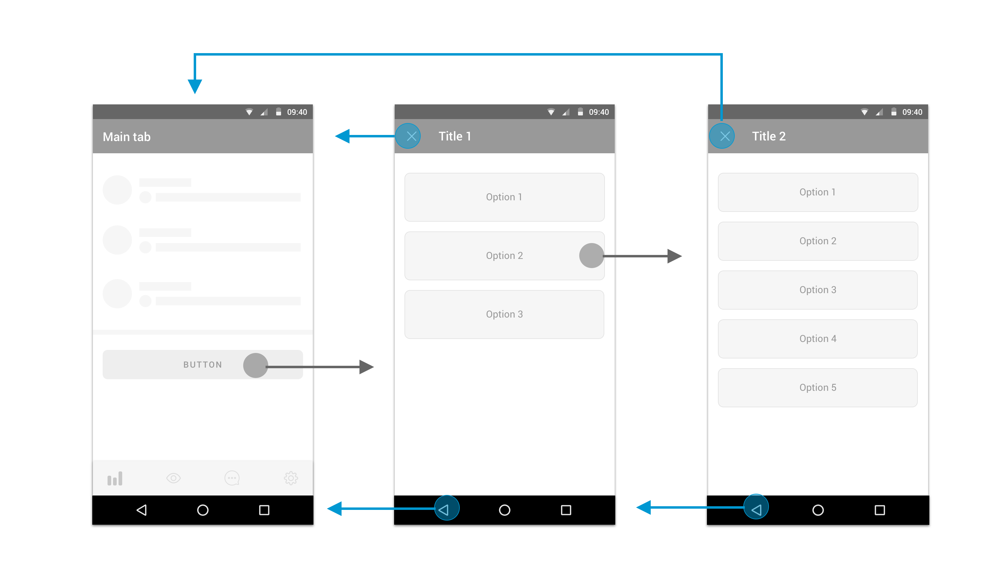
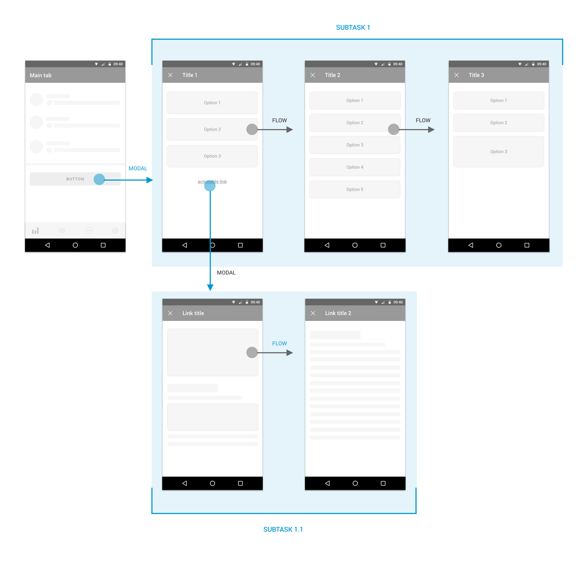
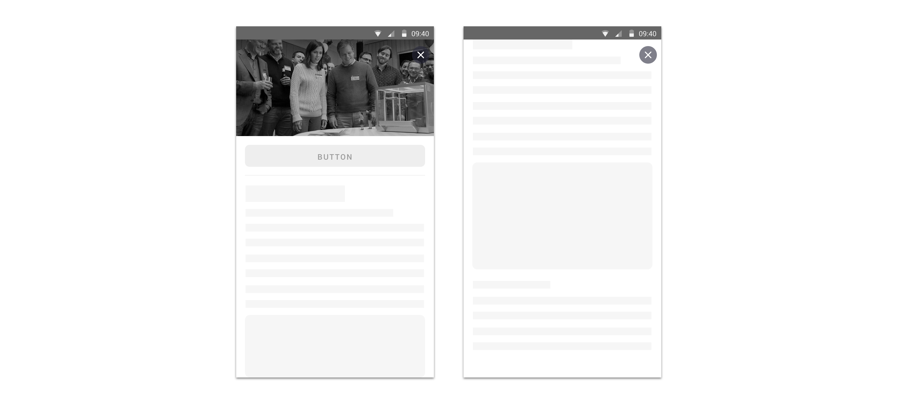

## Description

This type of webview is a way to step out of the normal flow of the app so the user should accomplish something prior to continuing on their way.

Consider creating a modal context only when a task must be completed or abandoned to continue using the app.

## **Applications**

### **Subtask flow that can be abandoned**

Non critical subtasks, so it doesn’t matter if the users leave, that should be accomplished or abandoned to continue using the app.


**Don’t apply to purchase flows. For internal purchase flows should always be applied**[ **Internal Webview mode with Flow Presentation**](flow.md)**.**


## **Behaviour**

This mode gives the user the opportunity to leave the whole flow and also the possibility of going back chronologically.

A subtask could have several steps/screens. Modal presentation should be applied for the first screen, and flow presentation should be applied from the step 2 to the end of the subtask. Close option will remain until de subtask is finished or abandoned.

### **Back behaviour**

Native back is chronological \(back one step\)  
Close action - the user abandons and closes the modal webview.

### **Entrance transition**

The default transition vertically slides the modal view up from the bottom of the screen and back down once dismissed.

### **Progress indicator**

Android circular progress indicator with brand color + generic text

### Error

No connection text + tap to reload button for connection errors  
Generic text + tap to reload button for other errors

### Title

Once the webview finishes loading it will use the title from the &lt;title&gt; html tag \(document.title\) to populate the title in the navigation bar.

It could be modified using the web view javascript bridge message SET\_TITLE.

## Screen Configuration

### Bottom nav

Not configurable - Always false.

### Nav bar

True - by default

False - when an image is designed to reach the top of the screen  
Actions keep floating when user scrolls down

## Useful links 

How is it in iOS?



 Related technical documentation



