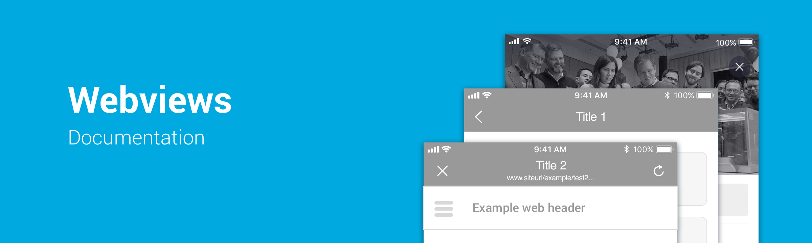

# Webviews

In Novum there are native screens living with webviews througout the app. Here you can find all the instructions that let you know what type of webview should be applied in any case, and how to do it in a right manner.

This documentation is split in both operative systems, so it takes into account the particularities and patterns of each system. The definition of the different modes is the same but the configurability of each mode can change depending on the platform.

### Android
* [internal flow](android/internal/flow.mdx)
* [internal modal](android/internal/modal.mdx)
* [browser](android/browser.mdx)
* [configuration by default](android/configuration-by-default.mdx)

### iOS
* [iOS internal flow](ios/internal/flow.mdx)
* [iOS internal modal](ios/internal/modal.mdx)
* [iOS internal browser](ios/browser.mdx)
* [iOS configuration by default](ios/configuration-by-default.mdx)

