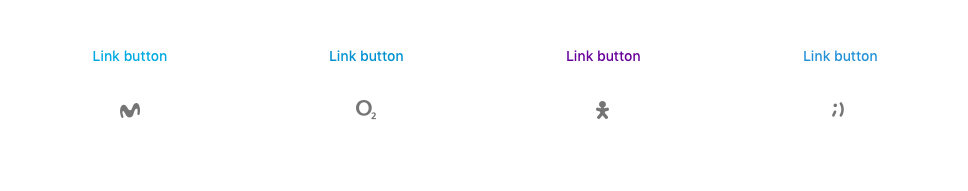
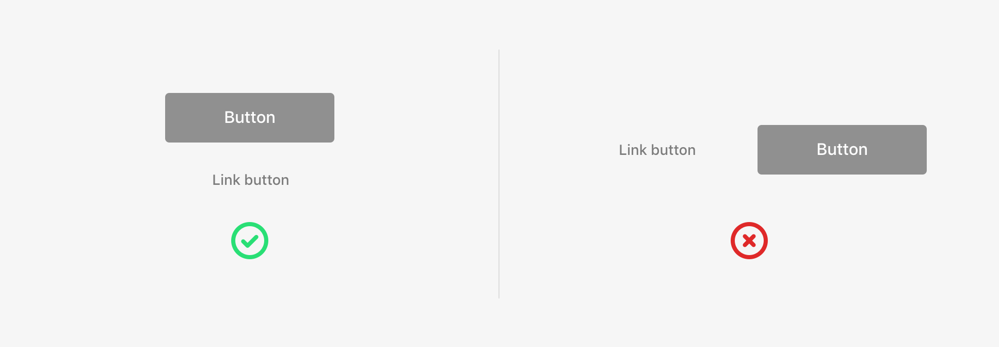
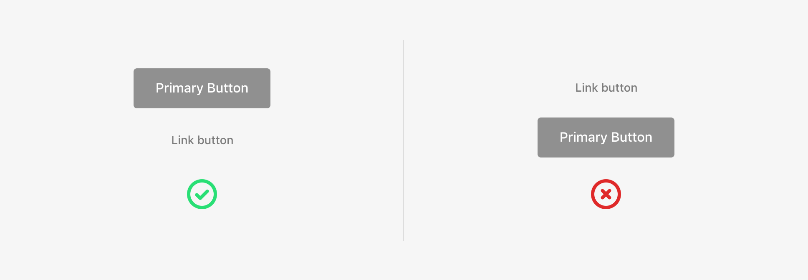
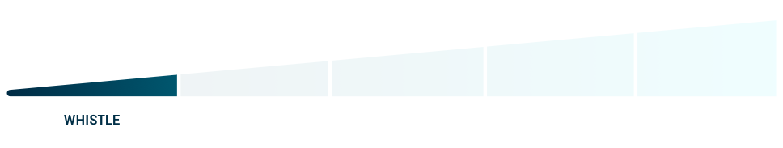
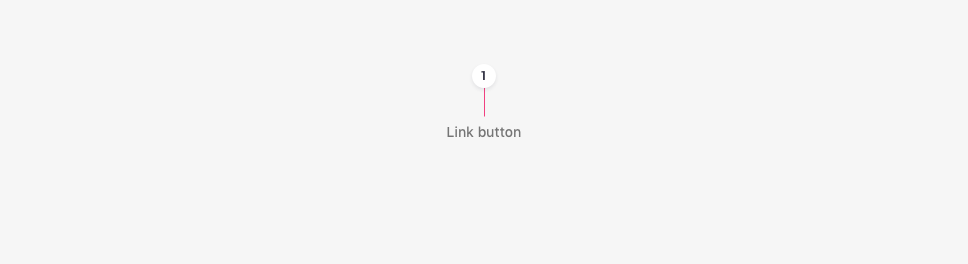
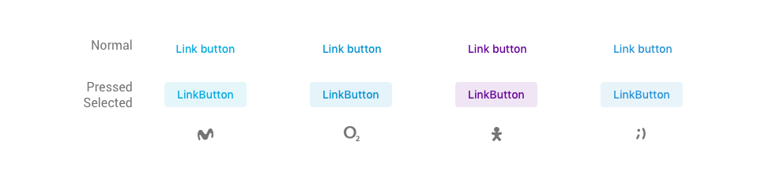

# Link button

## Usage

Link buttons are used when we want to take users out of the flow they are in and then **return them to the same screen**. They are used to **expand information** about the content you are looking at. ‌

They are never placed horizontally next to another action. They take up the **entire width of the layout** and follow the rules for placement and hierarchy in relation to the other buttons.

## Hierarchy

A link is the action with the **lowest hierarchy**. Because of that, they always go in the **last place** preceded by the other buttons with higher relevance.

## Emphasis

A link is an action with a **low communication weight**. With links, we are whistling to users and whispering about a specific action.

## Anatomy

### Text label

It should describe the action that is going to happen when the user interacts with the button as concisely as possible.

## States

A link button can have the following states:

* Normal
* Pressed \(Android\) or Selected \(iOS\)
* Focus \(Accessibility\)

