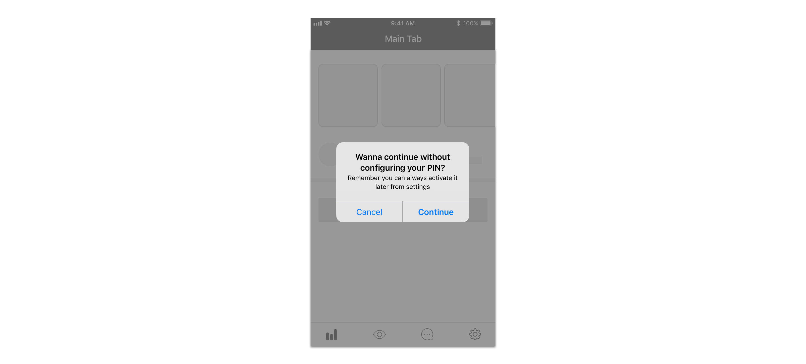

# Alert

We use alerts for

* [action confirmations](../../feedback-scenarios/action-confirmation.md)
* [action requirements](../../feedback-scenarios/action-requirement.md)
* [error messages](../../feedback-scenarios/error-scenario.md)

## Use considerations

Generally, use two-button alerts to provide an easy choice between two alternatives. The button people are most likely to tap should be on the right and formatted with bold style. Cancel buttons should always be on the left. 

We use alerts to confirm the exit of a multi step process. In these cases, always provide a “Cancel” alternative button formatted in bold.

Please use short, descriptive and easy to understand copywriting. Avoid technical jargon and alarming language. Also try to keep messages short enough to fit on one or two lines to prevent scrolling \(80 characters maximum\). 

For actions, use title-style capitalization and no ending punctuation. Use OK for simple acceptance rather than “Accept” or “Continue”. Use “Cancel” for the action that just closes the alert. If the “Cancel” copy it’s too similar to the alternative action \(“Abandon” for instance\), consider using “Not now” to avoid confusion. 

Try to convey all the important information using the title and the actions, as users are likely to read this information only. Use the small text to provide additional but non-essential information.


We use alerts when users hasn't acceptance of terms and conditions and wants to continue with a process.


