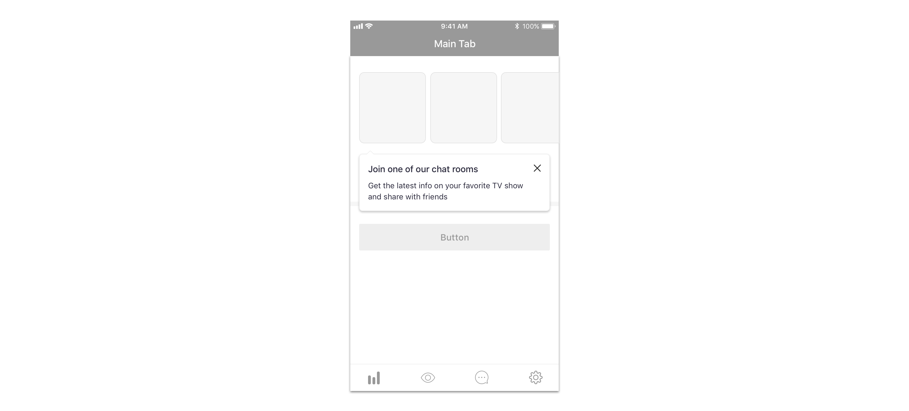

# Tooltip

We use tooltips for

* [contextual guides](../../feedback-scenarios/contextual-guide.md)

## Use considerations

Copywriting in tooltips should be specially short and concise. Tooltips are not used for promotional messages, use only with descriptive and functional content. 

Tooltips can be triggered automatically or by user interaction and they always refer to specifics elements of the interface, pointing to them with their arrow \(pointing up or down depending on the position of the element they refer to\).

Users should always be able to close a tooltip, either by tapping the same element it triggered them initially or by tapping a close icon inside the tooltip.

More than one tooltip can never be shown in the same screen.

