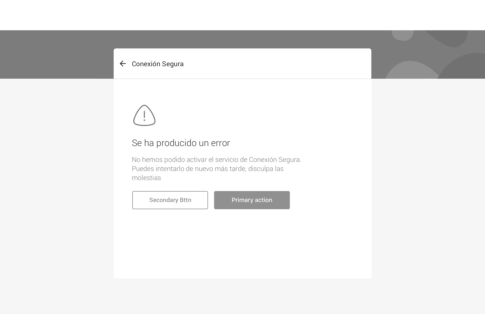

# Error screen

We use error screens for

* [error messages](../../feedback-scenarios/error-scenario.md)

## Use considerations

Typically use a maximum of two actions to guide users to whatever is best next based on the flow they just completed. Always make the most likely one prominent by using a primary button and format the rest as links to provide contrast. 

If the process or action that triggered the error can be retried it may be a good idea using a “Retry” button as the primary action, especially if the error is something that may be temporary and the chances of success when retrying are high.

