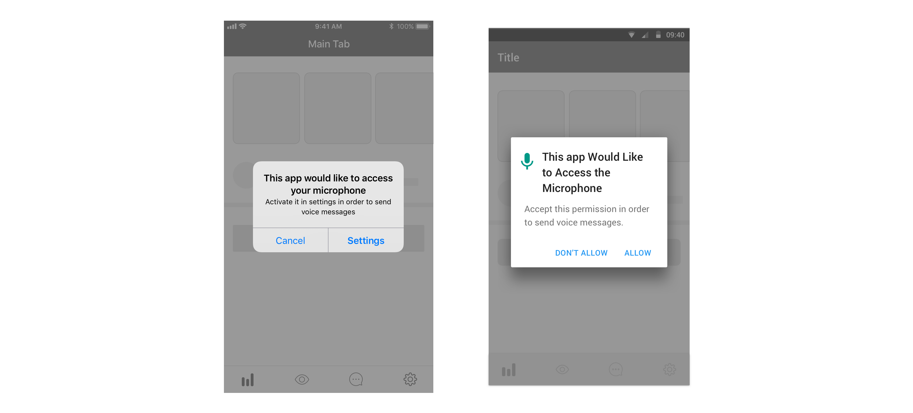

# Action requirement

## Definition

We define action requirements as messages where we need to interrupt users on their current flow and make them perform an action. These messages may or may not be triggered by an action performed by the user: 

* Example 1: We may want to show a message for users to rate our app in the stores  
* Example 2: After triggering an action, we may want users to activate an app permission in order to complete that given action.

## Component use

Please use:

* for iOS an [alert](../components/ios/alert.md)
* for web a [dialog](../components/web/dialog.md)
* For Android use a [dialog](../components/android/dialog.md). If the action is related to device permissions, use the specific format for this: the permission dialog

