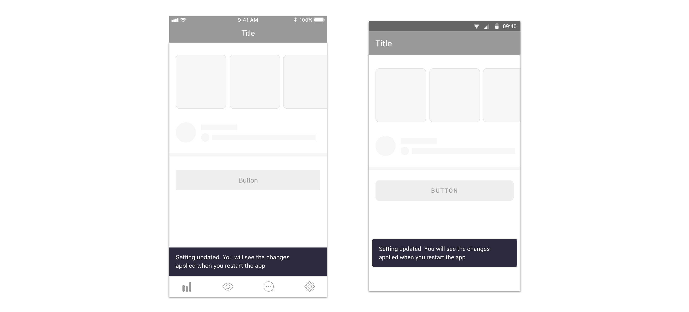

# Success messages

## Definition

We define success scenarios as those where we need to communicate users that an action or process has been completed without any errors.

## Component use

**By default, try to communicate the success of an action or process implicitly** in the user interface without using a specific component. Ideally the result of that action or flow should be clearly visible in the very own interface:

1. Example: creating a support query through a multi-step process results in the redirection to the detail screen of that query just created. 
2. Example two: completing a “send balance” process from a conversation results in a message being inserted into it.

For long multi-steps processes or those where any kind of purchase is involved \(plan upgrades, top up’s, etc.\) a success screen should be used. This is a specific screen that explicitly states the success of the process and is able to provide extra information or multiple actions to do next.

Please check out:

* for iOS the [iOS success screen](../components/ios/success-screen.md)
* for Android the [Android success screen](../components/android/success-screen.md)
* for web the [web success screen](../components/web/success-screen.md)

For **small and very specific actions** where it’s not possible to communicate success implicitly and where a success screen may be unnecessary \(for short processes or those not related with purchases, balance, upgrades, etc.\) consider using:

* in iOS a [crouton](../components/ios/crouton.md)
* In Android a [snackbar](../components/android/snackbar.md)
* in web a [snackbar](../components/web/snackbar.md)

Please use this components **sparingly**, as we should communicate implicitly the success of any action or process whenever possible.

