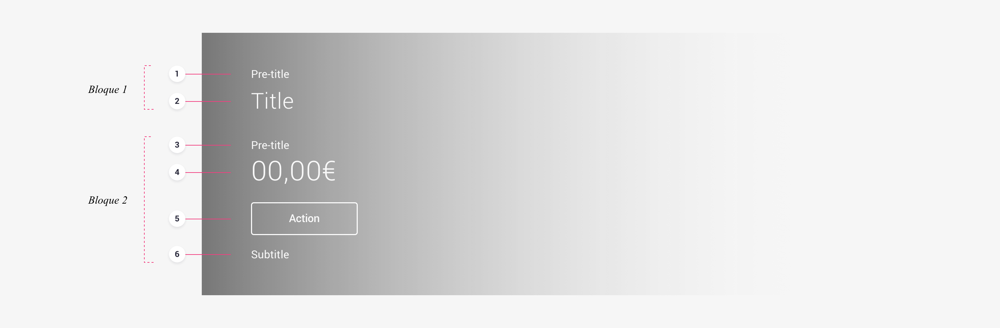

# Structure

## App

### Anatomy

Conceptually, a header is made up of two blocks of related information, with these blocks being made up of different elements. We can use six different elements to communicate a message. Of these six, only the _Title_ is mandatory in the construction of headers.

_Block 1_

* **Pre-title** \(optional\) The pre-title provides the necessary context to understand the title.
* **Title** \(mandatory\) The title provides the main message that we want to communicate to users.

_Block 2_

* **Pre-title** \(optional\) The pre-title provides the necessary context to understand the information provided by this second block.
* **Amount** \(optional\) The amount is used to represent quantities \(money, gigabytes, etc.\)
* **Action** \(optional\) This is an interaction element. It allows users to take immediate action and decisions based on contextualised information.
* **Subtitle** \(optional\) The subtitle amplifies the information contained in the header, providing further information that is also relevant to the user.

## Website

### Typology

On the website we lack the _Navigation Bar_ component, and therefore its _Large_ version that we use in the main tabs of our product's app. Due to the need to have a type of header that transfers the composition and visual weight of the app's Large Navigation Bars to the main sections of desktop site, we differentiate between:

* **Main Tab Header** The Main Tab Header is equivalent to the Large Navigation Bars in the app
* **Common Header** The Common Header is equivalent to the Headers in the app

### Main tab header

#### Anatomy

Conceptually, a _Main Tab Header_ is made up of two blocks of related information, with these blocks being made up of different elements. There are three elements with which we can communicate a message. Of these three elements, only the _Title_ is mandatory in the construction of headers.

_Block 1_

* **Title** \(mandatory\) The title provides the main message that we want to communicate to users.
* **Description** \(optional\) The description amplifies the information.

Block 2

* **Action** \(optional\) This is an interaction element. It allows users to take immediate action and decisions based on contextualised information.

### Common header

#### Anatomy

As with the app, a _Common Header_ is conceptually made up of two blocks of related information, with these blocks being made up of different elements. There are six elements with which we can communicate a message. Of these six elements, only the _Title_ is mandatory in the construction of headers.

_Block 1_

* **Pre-title** \(optional\) The pre-title provides the necessary context to understand the title.
* **Title** \(mandatory\) The title provides the main message that we want to communicate to users.

_Block 2_

* **Pre-title** \(optional\) The pre-title provides the necessary context to understand the information provided by this second block.
* **Amount** \(optional\) The amount is used to represent quantities \(money, gigabytes, etc.\)
* **Action** \(optional\) This is an interaction element. It allows users to take immediate action and decisions based on contextualised information.
* **Subtitle** \(optional\) The subtitle amplifies the information contained in the header, providing further information that is also relevant to the user.

