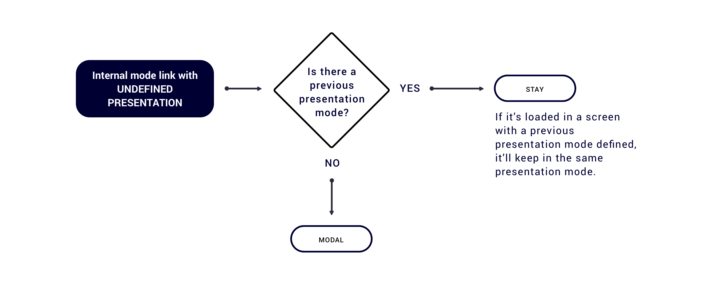
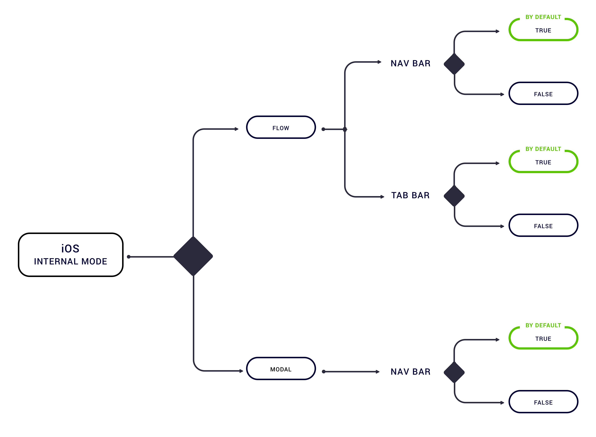

# Configuration by default

Webview modes and presentations will be inserted in the URL as a parameter.   
When no parameters are found in the URL in order to perform a demanded mode, a mode and transition by default will be applied. 

By default scenarios for **undefined mode**:  
\(common in both platforms\)

**Given an**[ **internal mode**](../android/internal/), by default scenarios for **undefined presentation**:  
\(common in both platforms\)

**Given an** [**internal mode**](https://tef-novum.gitbook.io/novum/~/edit/drafts/-L_lhdpNgDzMLvPhEui4/design/webviews/android/internal), configurable options by default:

