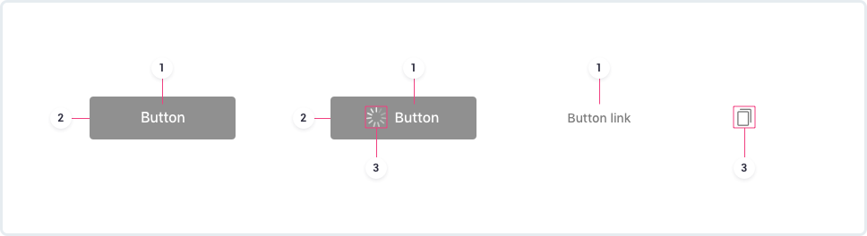
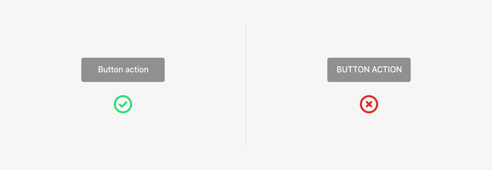

Buttons are composed using **common elements**: text, container and icon. Depending on the button type, some elements are **required** while others are **optional**.

## Text label

Text labels should describe the action that will happen when the user interacts with the button.

In addition, the text should be formatted like a sentence, with the first letter of the sentence in upper case and the following letters in lower case \(unless the word is a proper noun\).

## Container

This is the button background where the content will be placed

Every OB has specific background colours in its brand palette. The colours affect the primary, secondary and danger buttons.

## Icon

This element can accompany a text label to communicate a message more clearly. When it's working independently, it should have a strong visual and representational impact.

