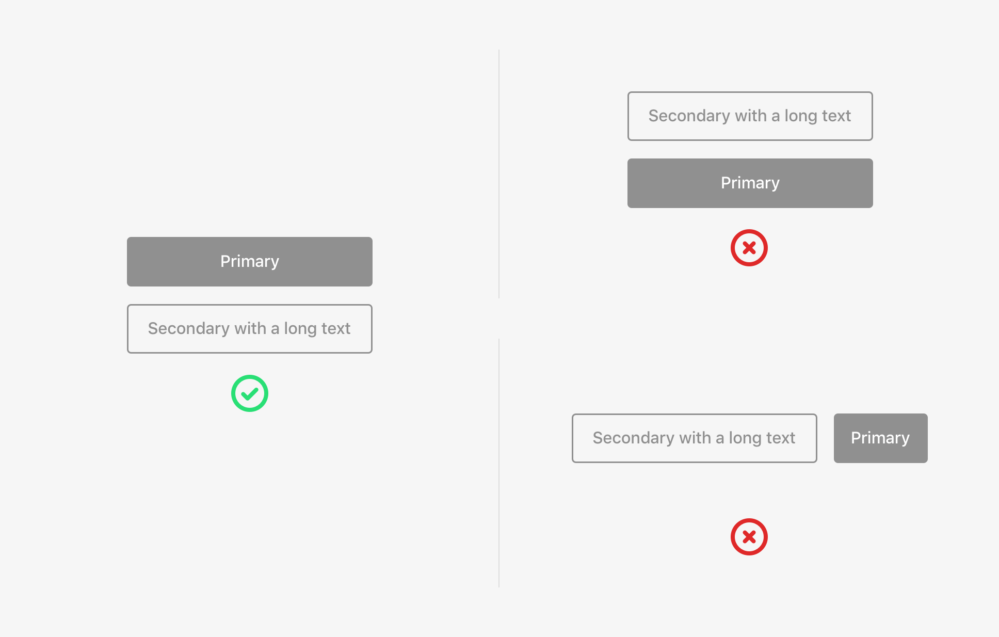
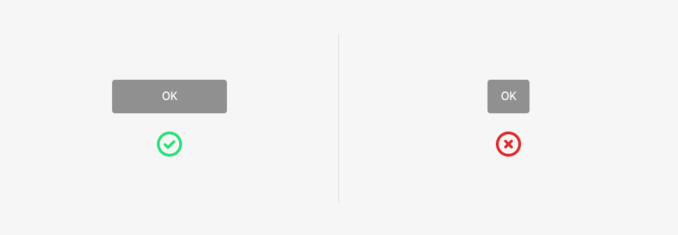
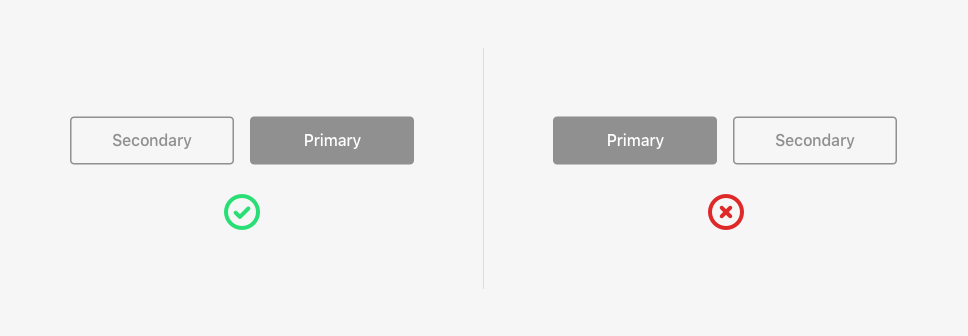
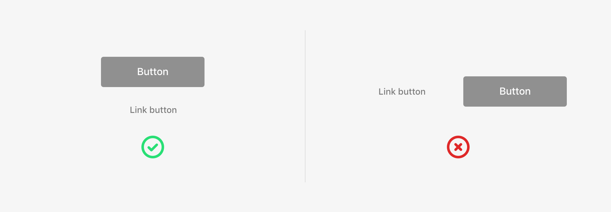
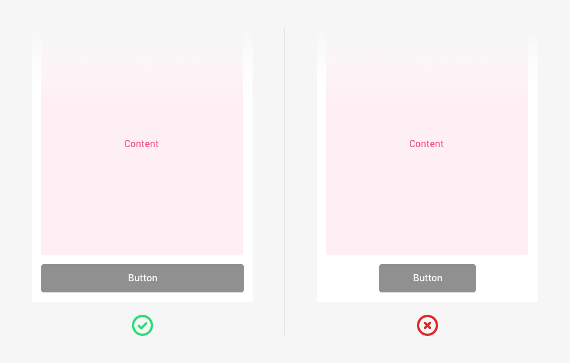
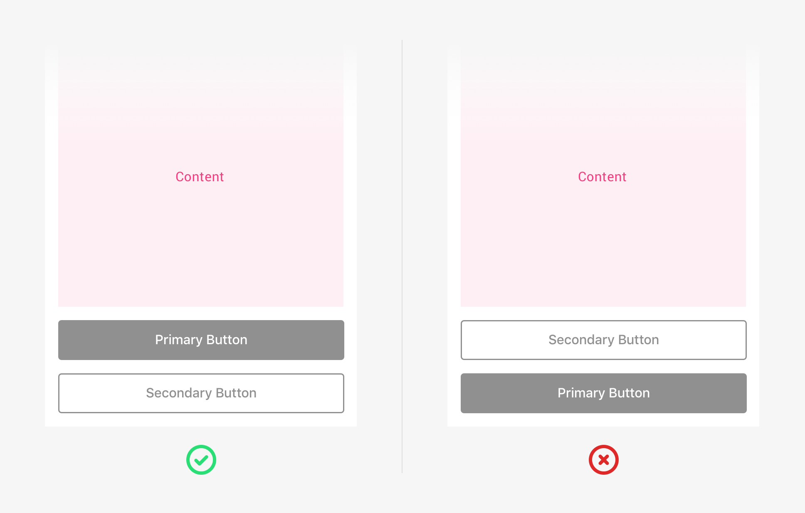
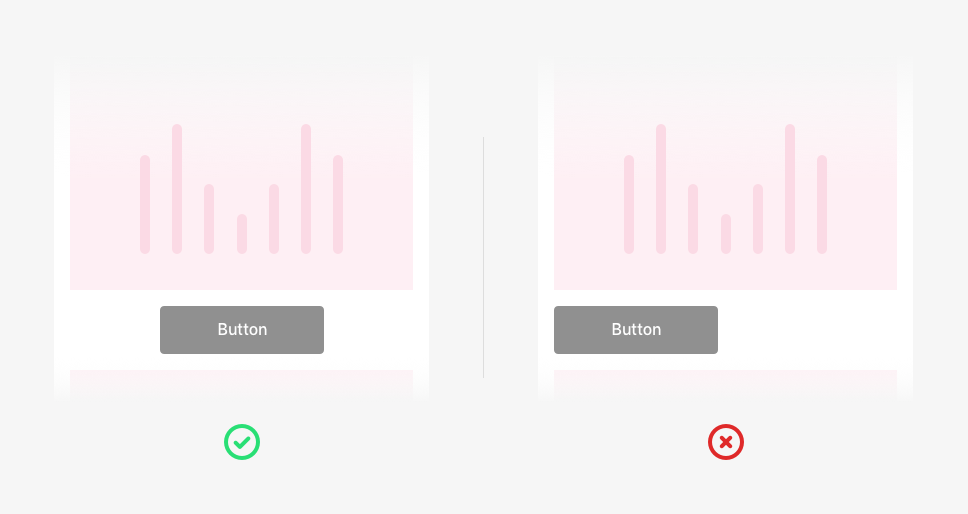
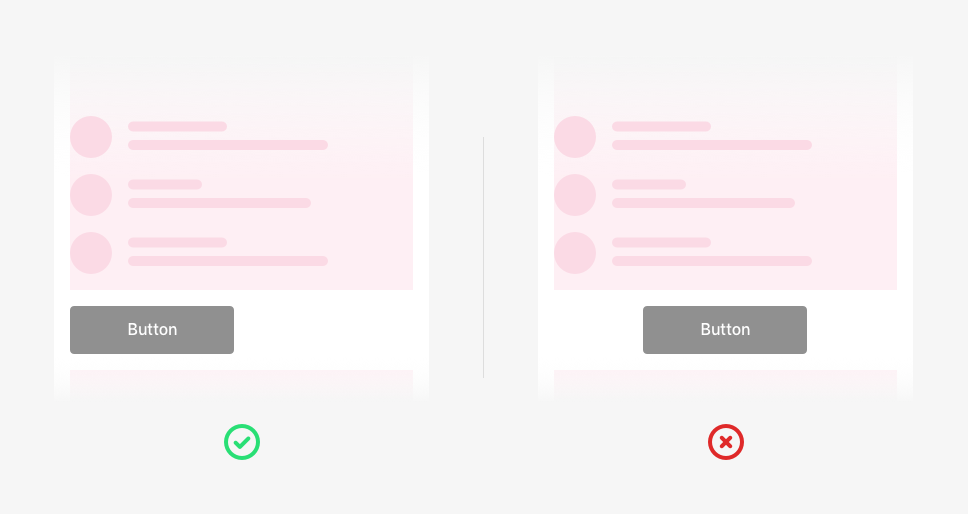

Some basic patterns for positioning buttons throughout the app need to be established so an appropriate coherence and hierarchy can be maintained across all screens.

When we talk about positioning, we need to pay attention to 2 important things:

* Positioning the buttons **in relation to each other and with other interface components**.
* Button positioning **relation to the layout**.

## Positioning and relationships between buttons

Buttons associated with components or outside flows and processes The buttons should follow specific rules for positioning depending on the number of actions present.

### 1. Buttons associated with components or outside flows and processes

The buttons should follow specific rules for positioning depending on the number of actions present:

#### One action

El tamaño del botón vendrá definido por el contenido de este \(text label\), partiendo siempre de un mínimo de 156px de anchura.

**Two actions**

Generally speaking, they will be positioned horizontally and take up the entire width of the space from one side to the other. This makes it possible to optimise the space without cluttering up the interface. The secondary action should be placed on the left and the primary action on the right.

When the width of the text is greater than the minimum button width \(when the text is wider than what the button padding allows\), the buttons should be placed vertically, one on top of the other. The primary action should be placed above the secondary one. In this case, the size of both buttons will be determined by the largest button.

If the second action is a link button, the buttons should never be placed horizontally, one beside the other, but vertically with the link button under the other button.


There can never be more than two actions associated with a component or outside flows and processes. A good practice is that you should always use fewer buttons and only when they are really needed.

_E.g. Don't use a “back” button when you can go back using natural navigation elements._


### 2. Buttons in flows and processes

In these cases, the buttons should be positioned one below the other taking up the entire width of the screen. ‌

Later on, we'll see how these buttons should be positioned in relation to the content.

### 3. Link button position

As we've seen, link buttons should never be placed horizontally next to another action. They should take up the entire width of the layout and follow the placement and hierarchy rules in relation to the rest of the buttons. The link goes after the other buttons from higher to lower relevance.

### 4. Tablet and desktop

When the resolution of the screen increases, the space reserved for components also increases, buttons included.

#### One action

The size of the button will be defined by its content \(text label\), but it will always have a minimum width of 156px.

#### Two actions

Buttons will be positioned horizontally, one beside the other, placing the main action on the right. The size of the buttons will be determined by the size of the biggest button.

If the second action is a link button, the actions should be positioned horizontally one next to the other. And the link button should be on the right and the main action should be on the left.

## Button position in relation to the layout

Buttons can be positioned in different places in relation to the content that precedes them.

‌ The positioning of the buttons on the layout depends on the kind of screen the user is using \(onboarding, forms, empty cases, feedback\), and the coexistence of other elements in the interface.

### 1. In flows

In flows, where users need to move forward and make decisions that affect the entire screen, **the button should always be placed statically at the bottom of the screen** and take up 100% of the width. ‌

If the content is greater than the screen height, when the content is scrolled it will go underneath the actions area, which remains static. ‌

The button will always be visible, because a visible button works better than one that is hidden either below the fold or under the keyboard. Consequently, when the keyboard appears on the screen to enter information that actions area will move upwards with it.

This provides better coherence and stability. A button within a flow will not be moved depending on the page content, number of inputs, errors that may arise or from one screen to another.

#### One action

The button should be statically positioned at the bottom of the screen and take up 100% of the width of the grid.

#### Two actions

Actions are placed above each other. Less important action should be placed under the primary one. The size of the buttons occupies 100% of the screen width.

### 2. In components

The rules stated above are for actions on flow and process screens. However, if a button is associated and related with a component, the button should be placed beneath the component and positioned in relation to the distribution of its content.

