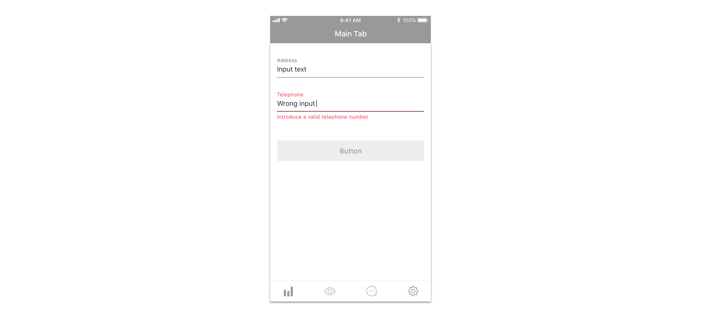

## Use considerations

Forms have a specific format to give users feedback on their completion and possible errors.

Errors are always specific to the input they refer to, telling users with as much as precision as possible the information they need to complete it successfully. Please use concise but helpful copywriting for these messages and avoid being vague or too general.

Also take into account that form errors related with login are an exception to this rule. They shouldn’t point out a specific form element to avoid any possible unauthorized access. Show these errors with a general message in an alert instead.

These error messages are persistent until users retry submitting the form. 

