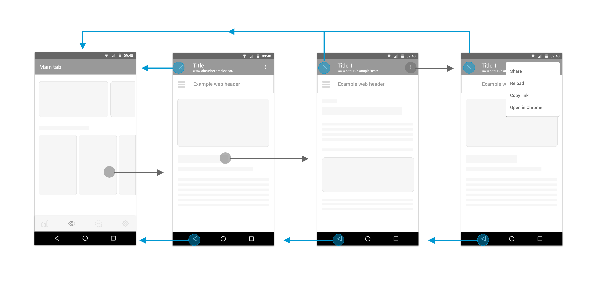

This type of webview helps to make it clear for the users that they are taken to another web, but keep them into our app. From the user’s point of view, they are aware of being in a webview.

## Description

This is an internal webview designed for containing **external known websites**.

* **External websites** are those that aren’t prepared to work as part of our app simulating a native screen. This websites have their own navigation and/or footer and users could navigate to a different website from them. 
* It’s a **known domain** when the url is under any ob’s domain and its content is related to the ob’s products and services. It should meet the technical conditions required to be classified as a known domain.  

## **Applications**

Launching an external website URL inside the app, only when it belongs to a known domain

## **Behaviour**

It gives to the users the opportunity to navigate inside the webview or to leave it and back to the app as well as other native browser options.

### **Back behaviour**

Native back is chronological \(back one step\)  
Close action - the user abandons and closes the webview.

### **Entrance transition**

The default transition vertically slides the modal view up from the bottom of the screen and back down once dismissed.

### **Progress indicator**

Lineal progress indicator with brand color under the navigation bar. The indicator animates along the length of the track.

### Error

No connection text + tap to reload button for connection errors  
Generic text + tap to reload button for other errors

### Title

Once the webview finishes loading it will use the title from the &lt;title&gt; html tag \(document.title\) to populate the title in the navigation bar.

## Screen Configuration

### Bottom nav

Not configurable - Always false.

### Nav bar

Not configurable - Always true.  
URL is shown in the navigation bar.  
Kebab menu with browser options in the navigation bar.

  

